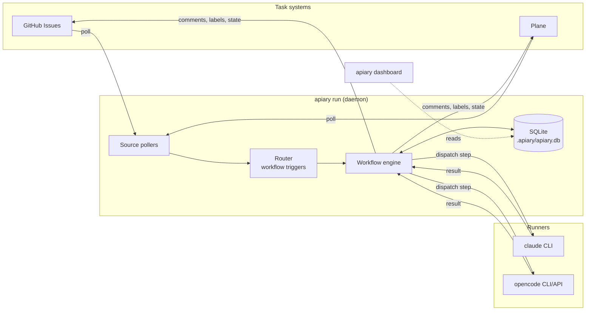

# Concepts

Apiary is a **task-driven agent orchestration harness**. It connects project
management tools (GitHub Issues, Plane, …) to AI agent runners and routes each
task to the right agent and model based on declarative rules — no human
dispatcher in the middle.

```
Task System ──► Apiary ──► Agent ──► LLM Model
  (GitHub)      (router)  (engineer)  (claude-sonnet-4-6)
```

## Vocabulary

| Term | Meaning |
|---|---|
| **Hive** | A configured Apiary instance — one `apiary.yaml` plus its `.apiary/` state directory |
| **Source** | A task-system integration that polls work items and writes results back (GitHub, Plane, …) |
| **Task** | A unit of work flowing through the system — born from a source item (an issue) or spawned internally by another task |
| **Runner** | *How* an agent executes — a CLI subprocess (`claude`, `opencode`, `cursor`) or an API call |
| **Agent** | A named LLM persona: runner + model + optional soul file, skills, identity, and fallbacks |
| **Workflow** | A pipeline of steps, fired by a `trigger` that matches tasks; each agent step runs an agent |
| **Trigger** | The matching rule (labels, states, source, …) that decides which workflow handles a task |
| **Workflow instance** | One execution of a workflow against one task — what `apiary instances` lists |
| **Step run** | One step of an instance: an agent invocation, an approval gate, a CI wait, a split decision |
| **Soul file** | A markdown file holding an agent's system prompt / persona |

## Architecture



The daemon (`apiary run`) does all the work; the [dashboard](dashboard.md) and
the CLI inspection commands (`status`, `instances`, `task`) are read-only
windows into the same SQLite store, connected over a local IPC socket.

## Lifecycle of a task

1. **Poll.** Each source polls its tracker on its `poll_interval` and returns
   the items passing its `filters`. Polling is read-only and idempotent — the
   same open issue shows up every cycle.
2. **Route.** The router evaluates workflow `trigger`s in ascending `priority`
   order (lower number first). Every matching workflow gets an instance — a
   task can **fan out** to several workflows — unless a matching trigger is
   marked `exclusive: true`, which claims the task and stops evaluation.
   In-flight and already-completed work is tracked internally, so a task is
   not re-dispatched while it runs (and never again, for `once: true`
   triggers).
3. **Execute.** The workflow engine runs the instance step by step: agent
   steps dispatch a runner subprocess/API call, [approval and `wait_for`
   steps](workflows.md#approval-steps) park the instance until a human or CI
   resolves it, splits and conditions pick a path. Every attempt, token count,
   and log line is recorded.
4. **Write back.** Agents can publish progress to the source item mid-run
   ([`APIARY_PUBLISH`](tasks-and-fanout.md#apiary_publish-write-back)), and
   the workflow's `on_complete` / `on_fail` hooks set states and labels when
   the instance finishes.
5. **Settle.** When the last instance for a task reaches a terminal state, the
   top-level [`tasks:` hooks](tasks-and-fanout.md#task-level-hooks) fire once
   for the task as a whole.

## Internal tasks

Source items are not the only way work enters the system. An agent can
**spawn** child tasks at runtime ([`APIARY_SPAWN`](tasks-and-fanout.md)) — for
example, a product-owner agent decomposing a spec into implementation tasks.
Spawned tasks are first-class: they have lineage (parent → children), drive
their own workflow instances, and appear in the dashboard's Tasks tab. The
canonical unit of work is therefore the *internal task*; a source item (a
GitHub issue) is one possible **binding** of a task to the outside world.

## Where state lives

Everything is project-scoped, in a `.apiary/` directory next to your config:

```
.apiary/
  apiary.yaml    ← your config (alternative location)
  apiary.db      ← SQLite database (auto-created)
  apiary.sock    ← IPC socket between daemon and dashboard/CLI
  logs/          ← log files
apiary.yaml      ← your config (default location)
.env             ← auto-loaded environment variables (don't commit)
```

There is no server, no cloud component, and no telemetry by default. The full
table-level reference is on the [Data Model](data-model.md) page.

## Design principles

- **Declarative routing.** Which agent handles which task is config, not code.
  Change a label rule, restart, done.
- **Everything is recorded.** Every runner invocation — including rate-limit
  failovers and retries — is its own execution row with timing, tokens, and
  cost. The dashboard and `apiary task <id>` reconstruct the full history.
- **Credentials stay outside.** CLI runners authenticate however the
  underlying tool does; Apiary never stores or proxies provider credentials.
  Source tokens are read from environment variables.
- **Safe to leave running.** Rate-limit failover, a re-dispatch failure cap,
  non-blocking dispatch, and restart rehydration are built in — see
  [Rate limits & resilience](resilience.md).
