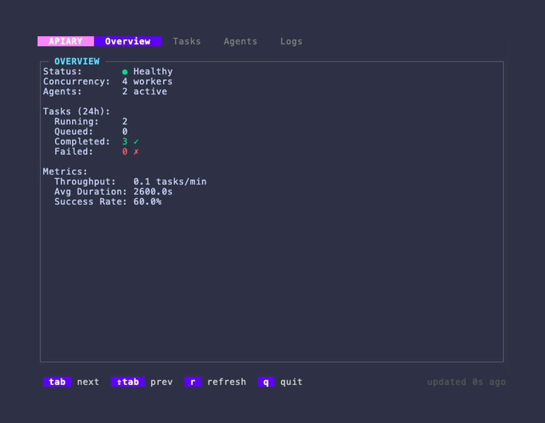
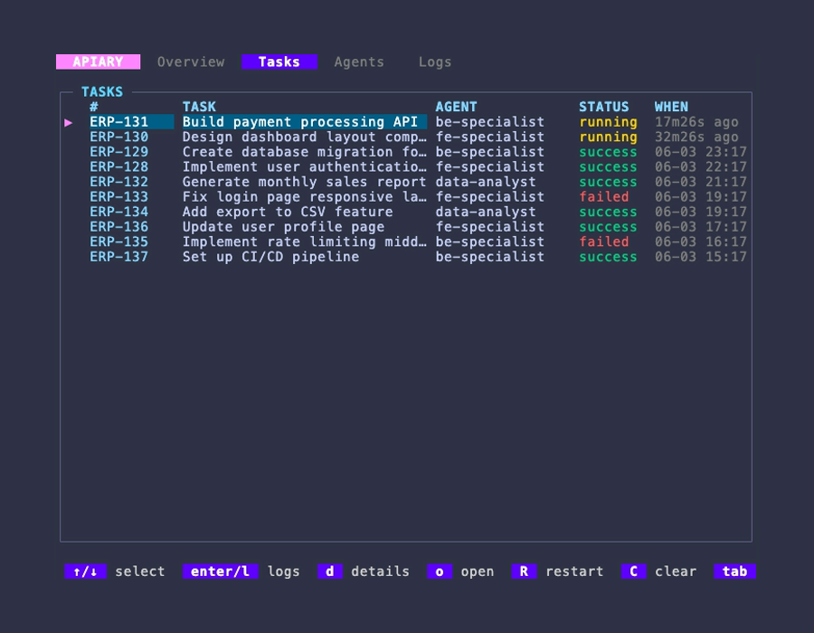
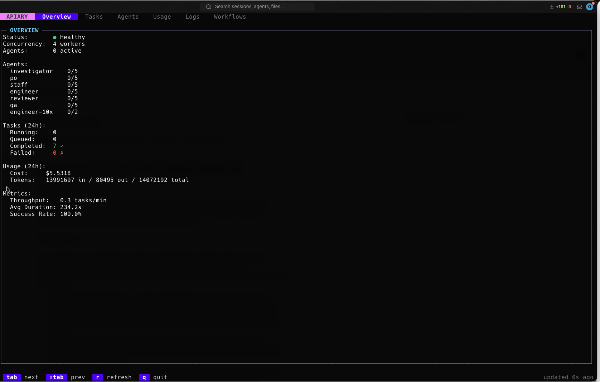
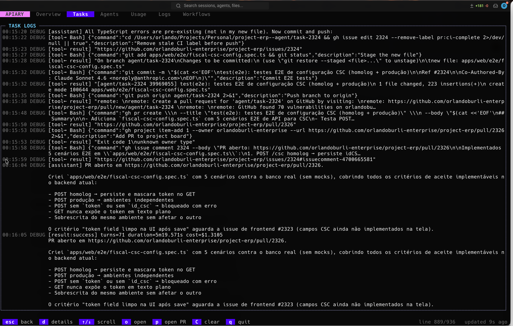
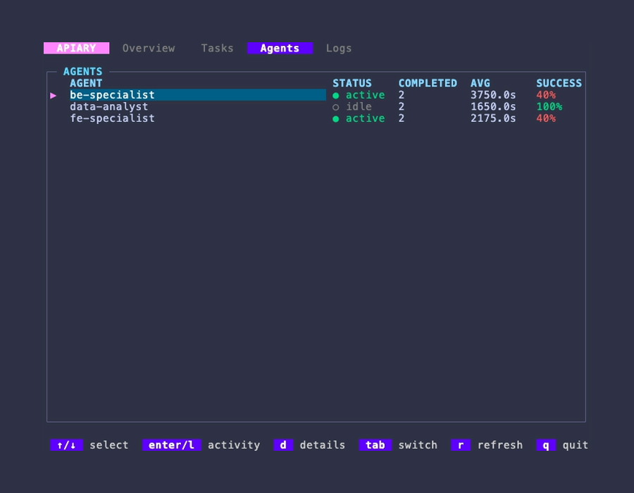

# Dashboard

The Apiary dashboard is a terminal app for watching your hive work in real time —
which tasks are running, how your agents are performing, and what the dispatcher
is doing right now.

```sh
apiary dashboard
```

## Before you start

The dashboard shows data produced by a running dispatcher. In a typical setup
you have two terminals:

```sh
# Terminal 1 — run the dispatcher
apiary run

# Terminal 2 — watch it
apiary dashboard
```

`apiary run` is headless — it does not draw anything itself, it just works in
the background and writes everything to the data store. `apiary dashboard` is
the window you open to watch it.

If you open the dashboard before the dispatcher has ever run, it will tell you
no data is available yet. Start `apiary run` and the dashboard will fill in on
its next refresh.

The dashboard only ever *reads* — you can open and close it as often as you
like without affecting running tasks.

> **Where the data lives.** Apiary is project-scoped: its state sits in a
> `.apiary/` folder next to your config file — the database at
> `.apiary/apiary.db`, logs under `.apiary/logs/`, and IPC socket at
> `.apiary/apiary.sock`.
>
> **Config file lookup order.** `apiary` looks for the config file in two
> places (in order):
> 1. `apiary.yaml` in the current directory
> 2. `.apiary/apiary.yaml` in the current directory
>
> This lets you keep everything tidy inside `.apiary/`:
> ```
> .apiary/
>   apiary.yaml        ← your config (optional here)
>   apiary.db          ← SQLite database (auto-created)
>   apiary.sock        ← IPC socket (auto-created)
>   logs/              ← log files (auto-created)
> apiary.yaml          ← your config (default location)
> ```
>
> Run `apiary dashboard` from the same directory as `apiary run` (or point
> both at the same config with `--config`) so they share the same project
> data.

## Getting around

The dashboard has four tabs along the top. Use the keyboard to move:

| Key                          | Action                                            |
|------------------------------|---------------------------------------------------|
| `←` / `→`                   | Switch between tabs                               |
| `Tab` / `Shift+Tab`         | Next / previous tab                               |
| `↑` / `↓`                   | Move the selection or scroll within a tab         |
| `Home` / `End`              | Jump to top / bottom                              |
| `PgUp` / `PgDn`             | Page up / down                                    |
| `Ctrl+U` / `Ctrl+D` / `Space` | Alternative page up / down                      |
| `r`                          | Refresh now                                       |
| `W` (Shift+W)               | [Start a workflow manually](#starting-a-workflow-manually) |
| `q` / `Ctrl+C`              | Quit                                              |

The active tab refreshes on its own every couple of seconds. The footer shows
how long ago the data was last loaded, so you always know how fresh it is.
Contextual help in the footer shows which keys are available in the current
view.

## The tabs

### Overview

Your at-a-glance health check. Use this tab to answer "is everything moving?"

- **Status** — dispatcher health indicator (Healthy / Degraded / Unknown) with a live glyph.
- **Uptime** — how long the dispatcher has been running.
- **Concurrency** — worker pool size (configured in `apiary.yaml`).
- **Active Agents** — agents that have processed work in the last hour.
- **Running** — how many tasks are being worked on this instant.
- **Queued** — tasks that failed and are waiting to be retried automatically.
- **Completed / Failed** — how much work finished today, and how much didn't.
- **Success Rate** — the share of today's work that succeeded. A sudden drop is
  your cue to check the Logs tab.
- **Avg Duration** and **Throughput** — how long tasks take and how fast they're
  clearing, so you can spot slowdowns.

Counts like Completed, Failed, Success Rate and Avg Duration cover **today**
(since midnight) and reset each day. Running and Queued are live right-now
numbers.



### Tasks

A list of recent tasks — both running and already finished — newest first. Each
row shows the task title, the agent that handled it, its status (running /
success / failed), and when it ran. Use `↑` / `↓` to move the `▶` marker.

From the list you can drill into the selected task:

| Key                    | Opens                                              |
|------------------------|----------------------------------------------------|
| `d`                    | **Details** — agent, model, runner, attempts, start/finish times, total duration, and the error message if it failed |
| `Enter` or `l`         | **Logs** — the per-task log lines for that run     |
| `o`                    | **Open** the task in your browser (its source URL) |
| `R` (Shift+R)          | **Force restart** — cancel and re-dispatch the task (with confirmation) |
| `W` (Shift+W)          | **Start a workflow** on the task, ignoring triggers and guards |
| `C`                    | **Clear logs** — delete all logs for the task (with confirmation) |
| `Esc` / `Backspace` / `h` / `←` | Back to the list                          |

The `#` column shows each task's human reference (e.g. `ERP-42`) so you can
match a row to the work item in Plane. Press `o` on any task — in the list, in
Details, or drilled into from an agent — to open it directly in the browser.

In the **Logs** view, `↑` / `↓` scroll through the lines, `Home` / `End` jump
to the top / bottom, and `PgUp` / `PgDn` (or `Ctrl+U` / `Ctrl+D` / `Space`)
scroll a page at a time. From either sub-view you can jump straight to the
other (`d` ↔ `l`) or press `r` to reload it.

Running tasks show how long they've been going; finished tasks show when they
completed. A task that was retried shows its attempt count in the Details view.





#### Workflow monitor

Pressing `Enter` on a task whose work is driven by a workflow opens the live
monitor: the step list on the left, and the selected step's detail — or its logs
— on the right.

| Key | Action |
|---|---|
| `↑` / `↓` | Move between steps |
| `Enter` / `l` | Open the selected step's logs in the right panel |
| `-` / `+` | **Resize the split** — narrow or widen the step list, 5% at a time |
| `[` / `]` | Switch between workflow instances, when a task fanned out to several |
| `t` | Open the step's [transcript](#watching-the-live-conversation-debug-mode) |
| `r` | Refresh the monitor |
| `X` / `R` | Stop the workflow / restart the whole task (both confirm first) |
| `Esc` / `Backspace` / `h` / `←` | Back (closes the log panel first, then the monitor) |

The split defaults to 40% and is clamped between 20% and 80% so neither panel
becomes unreadable. Widening the step list past the default reveals the `DUR`
column, which the default width clips. `-` / `+` work while the log panel is
open, which is usually when you want the extra room; resizing never disturbs
the step selection or scroll position.

#### Force restart and clear logs

Pressing **`R`** (Shift+R) on a selected task shows a centered confirmation
modal with a rounded border. Press `y` / `Y` to confirm or any other key to
cancel. This sends a restart request to the daemon via Unix socket: the task's
running dispatch and queued jobs are cancelled, its non-terminal instances are
interrupted, its control labels are stripped, and the item is re-routed and
dispatched **immediately** — it does not wait for the next poll.

The result appears as a one-line banner above the footer, and the list refreshes
straight away so the new run is visible:

- `✓ Restarted CDT-123 (10042) — dispatched 1 workflow(s): implement`
- `✗ Restarted CDT-123 (10042) — but no workflow matches it right now, so nothing was dispatched`

The banner names the item the way you know it — the Jira key, the GitHub issue
number — with the raw cell id in parentheses when the two differ.
- `✗ Restart failed: …` — the daemon's own message, e.g. an id that is an internal
  task id rather than a cell id.

Restart deliberately overrides the `once` and failure-cap guards (the banner names
what it overrode); it never overrides the in-flight guard, so a workflow that is
genuinely running is not started a second time.

Pressing **`C`** on a selected task works the same way — confirm with `y` / `Y`
to delete the task's logs and execution records, or any other key to cancel.

#### Starting a workflow manually

**`W`** (Shift+W) opens a picker listing every configured workflow. `↑` / `↓`
select, `Enter` starts, `Esc` cancels. It works from any tab.

Where `R` re-runs *whatever matches* an item, `W` runs *the workflow you name* —
matched or not. It skips the trigger's `match` block, exclusive suppression, the
live-instance guard, `once`, and the failure cap. Starting a workflow that is
already running on the task is allowed: the banner says so, and you get a second
concurrent instance.

The header of the picker names the target before you commit to it:

- **`item <id>`** — the task focused when you pressed `W`. The run binds it and
  writes back to the source like any other dispatch.
- **`standalone — no source item`** — no task was focused, or you pressed `s` to
  detach from it. The workflow runs on a fresh internal task; comments, state
  locks and sub-issues are no-ops for that run.

The result appears as the usual banner, e.g. `✓ Started triage on CDT-123 (10042)
(bypassed triggers and guards)`. Use [`apiary dispatch`](cli.md#apiary-dispatch)
for the same thing from a shell, where you can also pass `--input`.

#### Watching the live conversation (debug mode)

By default the per-task Logs show the milestones: the dispatch decision, the
agent's final output, and whether it succeeded. To watch the **full, real-time
conversation** with the agent — every message, tool call, and result, plus the
exact prompt that was sent and the routing decision that picked the agent —
start the dispatcher in debug mode:

```sh
apiary run --debug
```

With `--debug`, each task's Logs view fills in live as the agent works (the
dashboard refreshes every couple of seconds). You'll see, in order:

- **the routing decision** — which route matched, which were skipped and why,
  and the agent that was selected;
- **the prompt** — the exact text sent to the agent (task title, description,
  labels, and the agent's soul file);
- **the conversation** — `[assistant]` messages, `[tool→ …]` calls with their
  inputs, `[tool← result]` outputs, and a final `[result:…]` line with turns,
  duration, and cost.

These are `DEBUG`-level lines (shown in grey). Without `--debug` they are not
recorded, keeping normal runs lightweight.

The rich `[assistant]` / `[tool→ …]` breakdown comes from Claude's structured
event stream — the claude provider preset already requests it
(`--output-format stream-json --verbose`), so a plain runner is enough:

```yaml
runners:
  - id: claude-cli
    type: cli
    provider: claude
```

Apiary parses those events into the readable lines above. A CLI without
structured output still streams — you just see its raw output instead.

### Agents

How each of your agents is performing over time. For every agent you'll see its
status (active / idle), completed task count, average run time, and overall
success rate (color-coded).

Use this tab to compare agents — to spot one that's failing more often than the
others, or one that's much slower — so you can adjust which work you route to it.

An agent shows up here once it has actually run at least one task.

The Agents tab supports three levels of drill-down:

| Key                    | Action                                                             |
|------------------------|--------------------------------------------------------------------|
| `d`                    | **Detail** — full per-agent stats: status, running count, current task, completed / succeeded / failed counts, queued count, success rate, average duration, last task timestamp |
| `Enter` / `l`          | **Activity list** — all tasks handled by this agent (from activity: press `Enter` / `l` again to drill into that task's logs) |
| `o`                    | **Open** the task's source URL in your browser (from activity or task logs) |
| `Esc` / `Backspace` / `h` / `←` | Back one level (agent list → detail → activity → task logs)|
| `Home` / `End`         | Jump to top / bottom in activity list or task logs                 |
| `PgUp` / `PgDn`        | Page up / down in activity list or task logs                       |



### Logs

A live feed of what the dispatcher, router, and runners are doing, newest at the
bottom. Lines are color-coded so problems stand out:

- **Red** — errors
- **Yellow** — warnings
- **Blue** — informational
- **Grey** — debug / verbose

Use `↑` / `↓` to scroll back through recent activity. `Home` / `End` jump to
the start / end, and `PgUp` / `PgDn` (or `Ctrl+U` / `Ctrl+D` / `Space`) scroll
a page at a time.

| Key | Action                                              |
|-----|-----------------------------------------------------|
| `w` | **Toggle word wrap** — when on (default), long messages wrap. When off, `←` / `→` scroll horizontally by 8 columns |
| `←` / `→` | **Horizontal scroll** — only when wrap is off  |
| `r` | Refresh now                                         |

The footer shows your scroll position (e.g. `line 42/150`) so you always know
where you are. This is the first place to look when the Overview tab shows
failures.


## Troubleshooting

**The dashboard says there's no data / a tab looks empty.**
The dispatcher hasn't produced that kind of data yet. Make sure `apiary run` is
going in another terminal, then give it a task to work on. The Overview and
Agents tabs populate first as soon as work starts; the Tasks and Logs tabs fill
in as the dispatcher records running tasks and log activity.

**Numbers look stale.**
Press `r` to force an immediate refresh. The footer shows the last update time.

**The dashboard won't open.**
It needs the dispatcher's data store, which is created the first time you run
`apiary run`. Run the dispatcher once, then reopen the dashboard.

**I want to quit.**
Press `q` (or `Ctrl+C`).
