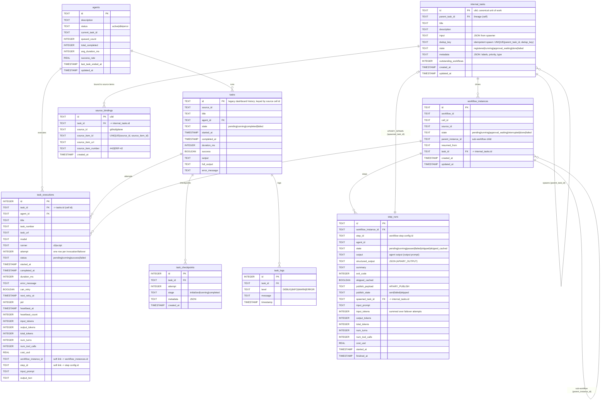

# Data Model

Apiary persists its state in a single SQLite database. The schema is defined in
`src/internal/db/schema.go` (base `CREATE TABLE` statements plus idempotent
`ALTER` migrations). This page is the canonical map of the tables and how they
relate.

## Entity-relationship diagram

Two standalone tables carry no foreign keys and are omitted from the graph:

- **`service_logs`** — `id`, `level`, `message`, `component`, `timestamp`
- **`dispatcher_state`** — `id`, `status`, `uptime_seconds`, `version`, `updated_at`

## Reading the model

### Two parallel "task" concepts

There are two task tables, which reflects the in-progress internal-task-model
migration (not an accident):

- **`tasks`** — the legacy dashboard history table, keyed by source cell id.
  This is what `task_executions.task_id` actually references.
- **`internal_tasks`** — the canonical, source-independent unit of work, with
  lineage (`parent_task_id`), source bindings, and the workflow instances it
  drives.

### Execution vs. step run

`task_executions` and `step_runs` describe the same work at different
granularities, linked by a **soft association** (not a database foreign key):

- A **`step_runs`** row is one logical step of a workflow instance.
- A **`task_executions`** row is one runner *invocation*. A single step can
  produce several execution rows when the primary runner is rate-limited and
  fails over to a fallback.
- The two are matched by `task_executions.workflow_instance_id` +
  `task_executions.step_id` against the owning `step_runs` row.

### Token usage, cost, and prompts

Per-step cost/usage detail is recorded in **both** layers:

- **`task_executions`** carries per-invocation timing, token counts
  (`input_tokens`/`output_tokens`/`total_tokens`), `cost_usd`, and the
  `input_prompt` / `output_text` of that attempt. Because there is one row per
  invocation, failovers stay distinct.
- **`step_runs`** carries the same token/cost columns as a **rollup summed
  across the step's failover attempts**, plus the `input_prompt` of the winning
  attempt and the agent `output`. This is the authoritative per-step total the
  dashboard displays.

The cost figure originates from the harness: the CLI runner parses the model's
streamed `total_cost_usd` and token counts — it is reported, not estimated.
