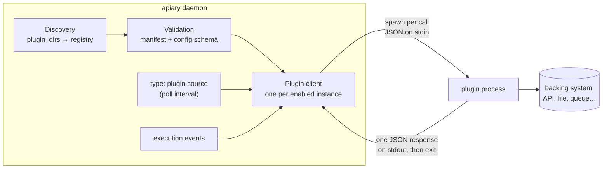

# Out-of-process plugins

Apiary protocol 1 runs third-party extensions as child processes instead of
loading Go binaries. A plugin crash, invalid response, or timeout terminates only
that invocation; it does not crash the dispatcher. Plugins are never executed
during discovery or configuration validation.

## Architecture

A plugin is an **executable file** (any language) installed in a directory
together with a manifest. The daemon never links against it and never keeps it
running: every call spawns a fresh process, writes one JSON request to its
stdin, reads one JSON response from its stdout, and the process exits.



The moving parts, in the order they run:

1. **Discovery** scans `plugin_dirs` for directories containing
   `apiary-plugin.json`, builds a registry, and rejects duplicate IDs. No
   plugin code executes during discovery.
2. **Validation** (`apiary validate`, `apiary plugins validate`, daemon
   startup) checks the manifest — schema version, semver compatibility with
   the host, protocol version, executable safety, checksum pin — and
   validates each enabled instance's `config` against the manifest's JSON
   Schema. Still no plugin code executes.
3. **Client creation** happens at daemon startup for every enabled instance
   whose manifest declares a capability the daemon integrates (see the
   [capability table](#protocol-version-1)). The client re-verifies the
   executable's checksum pin here and before every later invocation.
4. **Invocation** is where plugin code finally runs — see the lifecycle below.

### Invocation lifecycle

Each call is single-shot and stateless:

1. The client re-checks the pinned checksum (cheap `stat()` unless the file
   changed) and spawns the executable with a deadline (the instance's
   `timeout`, default 10s).
2. One compact JSON request — protocol version, request ID, capability,
   method, the instance's `config`, and the call payload — is written to the
   child's stdin, followed by a newline.
3. The plugin does its work (call an API, read a file …) and writes exactly
   one JSON response to stdout, echoing the request ID. Diagnostics belong on
   stderr.
4. The client enforces the contract: protocol version match, request-ID echo,
   a single response object, stdout ≤ 4 MiB, stderr capture ≤ 64 KiB. The
   deadline kills the process; a crash, timeout, or malformed response fails
   only that invocation.

Because every call is a fresh process, **plugins hold no in-memory state
between calls**. State lives in the backing system the plugin fronts (or a
file it manages). This is what makes the isolation story simple — there is no
long-running sidecar to supervise, leak, or restart.

### Process environment

| Aspect | Behavior |
|---|---|
| Working directory | The **plugin's install directory**, not the project root — relative paths in plugin `config` resolve there, so prefer absolute paths |
| Environment | Minimal allowlist (`PATH`, `HOME`, `TMPDIR`, locale/timezone) plus only the variables named in the manifest's `security.secret_env` — daemon secrets never leak in by default |
| Identity | `APIARY_PLUGIN_ID` and `APIARY_PLUGIN_PROTOCOL` are always set |
| Configuration | Passed inside every request (`config` field) — never via environment or files |

### How capabilities integrate

| Capability | When the daemon invokes it |
|---|---|
| `source` | A `sources[]` entry with `type: plugin` bridges to the instance; the daemon calls `poll` on the source's `poll_interval` and forwards `acknowledge`/`write_result` after dispatch. Polling only — plugins never push into the daemon |
| `event_exporter` | Once per persisted (redacted) execution event |
| `runner`, `workflow_action`, `approval_provider`, `secret_provider` | Reserved: manifest and transport are stable, daemon integration not yet wired |

Failure semantics follow the integration point: a failed `poll` is logged and
retried on the next interval like any source poll error; a failed `export` is
logged and dropped. A plugin can never take the dispatcher down.

## Install and enable

An installed plugin is a directory containing `apiary-plugin.json` and the
executable named by that manifest. The default search directory is
`.apiary/plugins` beside `apiary.yaml`; `plugin_dirs` overrides it.

```yaml
plugin_dirs:
  - .apiary/plugins
  - ~/.local/share/apiary/plugins

plugins:
  - id: dev.apiary.event-file
    enabled: true                 # omitted means true
    timeout: 5s                   # default: 10s, per invocation
    config:
      path: .apiary/events.jsonl
```

Use `apiary plugins`, `apiary plugins inspect <id>`, and
`apiary plugins validate` to inspect installations. `apiary validate` also
discovers every enabled plugin and validates its configuration against the
manifest's JSON Schema. Set `enabled: false` to keep an installed/configured
plugin available without starting or schema-validating it.

Relative plugin directories resolve beside `apiary.yaml`. Discovery is
deterministic and rejects duplicate IDs rather than choosing one by path order.

## Manifest version 1

```json
{
  "schema_version": 1,
  "id": "dev.apiary.event-file",
  "version": "1.0.0",
  "apiary": ">= 0.10.0-0",
  "protocol": 1,
  "executable": "apiary-plugin-event-file",
  "capabilities": ["event_exporter"],
  "config_schema": {
    "type": "object",
    "properties": {"path": {"type": "string", "minLength": 1}},
    "required": ["path"],
    "additionalProperties": false
  },
  "security": {
    "network": false,
    "read_paths": [],
    "write_paths": ["configured event file"],
    "secret_env": []
  }
}
```

- `id` is a lowercase reverse-DNS identifier and is stable across releases.
- `version` follows semantic versioning; `apiary` is a semantic-version constraint.
- `protocol` must be `1`. Unknown manifest/protocol versions fail closed.
- `executable` is relative to the plugin directory. Absolute paths, traversal,
  symlinks, non-regular files, and non-executable files are rejected.
- `checksum` (optional) pins the SHA-256 of the executable, as `sha256:<hex>` or
  bare hex. When present it is verified when the plugin client is created and
  again before each invocation, so a binary replaced after installation is rejected.
  A malformed value is an error rather than being treated as unpinned, so
  `apiary validate` catches a bad pin. This is **tamper-evidence, not
  authenticity**: the digest lives beside the binary, so anyone able to rewrite
  the executable can rewrite the pin too. It detects accidental drift and
  unsophisticated swaps, not a determined attacker with write access.
- `capabilities` accepts `source`, `runner`, `workflow_action`,
  `approval_provider`, `secret_provider`, and `event_exporter`.
- `config_schema` supports `type`, `properties`, `required`,
  `additionalProperties`, `enum`, `items`, `minLength`, `maxLength`, `minimum`,
  `maximum`, `minItems`, and `maxItems`. Unknown validation keywords fail closed.
- `security` is an inspectable declaration, not an OS sandbox guarantee.

## Protocol version 1

Apiary starts a fresh process for each invocation, writes one compact JSON object
plus a newline to stdin, and expects one JSON response on stdout. Diagnostic
output belongs on stderr. Stdout is limited to 4 MiB and captured stderr to 64
KiB. The per-instance deadline cancels and terminates the child process.

Request:

```json
{
  "protocol": 1,
  "request_id": "1784736000000000000",
  "capability": "event_exporter",
  "method": "export",
  "config": {"path": ".apiary/events.jsonl"},
  "payload": {"schema_version": 1, "type": "runner.started"}
}
```

Success and failure responses echo the request ID:

```json
{"protocol":1,"request_id":"1784736000000000000","result":{"written":true}}
{"protocol":1,"request_id":"1784736000000000000","error":{"code":"write_failed","message":"permission denied"}}
```

Capability method vocabulary:

| Capability | Protocol methods |
|---|---|
| `source` | `poll`, `acknowledge`, `write_result` (see [Source plugins](#source-plugins)) |
| `runner` | `configure`, `run` |
| `workflow_action` | `run` |
| `approval_provider` | `notify`, `remind`, `escalate` |
| `secret_provider` | `resolve` |
| `event_exporter` | `export` |

Protocol envelopes are stable; capability payloads use the corresponding
versioned Apiary internal contract. The runtime integrations are
`event_exporter` and `source`. The remaining capability names reserve the same
manifest and transport boundary for their proxies without requiring a new
installation model.

## Source plugins

A `source`-capable plugin is a **poll-mode work source**: the daemon bridges a
`type: plugin` entry in `sources:` to one enabled plugin instance and invokes
it on the source's `poll_interval` — plugins never push into the daemon.

```yaml
plugins:
  - id: com.example.nagios
    timeout: 10s
    config:
      api_url: https://nagios.internal/api

sources:
  - id: nagios-alerts
    type: plugin
    poll_interval: 30s
    config:
      plugin: com.example.nagios   # the plugin instance to bridge
    filters:
      labels: ["severity=critical"]
```

Methods (wire types in `sdk/plugin/source.go`):

| Method | Payload → result |
|---|---|
| `poll` | `{since, states, labels}` → `{items: [...]}` — the current work items; `states`/`labels` are the source's `filters`, forwarded for backend-side filtering |
| `acknowledge` | `{item, action}` → `{ok: true}` — called after dispatch; return ok if there is nothing to mark |
| `write_result` | `{item, success, output, error}` → `{ok: true}` — the run outcome; return ok if there is no result surface |

Each item's `id` is the dedup key: keep it stable per dispatch-worthy
occurrence and re-return ongoing items on every poll — the daemon's
task/instance dedup prevents re-dispatch, exactly as for the in-tree
monitoring sources. Items without an `id` are dropped. Timestamps are RFC3339
strings; `labels` use `key:value` form and drive workflow trigger matching.

Plugin-backed sources are **read-only**: they cannot host approval steps, CI
waits, `set_state`, or label write-back — `apiary validate` rejects workflows
that require those against a `type: plugin` source. Publish findings to a
ticket source (`APIARY_PUBLISH` / `APIARY_SPAWN`) instead.

Go plugin authors can import `github.com/orlandoburli/apiary/sdk/plugin` and call
`plugin.Main(handler)`. The SDK decodes one request, rejects protocol mismatches,
echoes the request ID, and emits the structured response envelope. Plugins in
other languages can implement the JSON examples above directly.

## Trust and secrets

Plugins execute with the Apiary service account's OS permissions. Before install:

1. Obtain the binary from a trusted publisher.
2. Verify its checksum and signature out of band.
3. Inspect the manifest's network, path, and secret requirements.
4. Install into a directory writable only by the Apiary operator/service account.

Apiary does not download or auto-upgrade plugins. Upgrade atomically by verifying
the new artifact in a staging directory, stopping Apiary, replacing the complete
plugin directory, running `apiary plugins validate`, and restarting. Keep the old
directory for rollback, but never leave two versions with the same ID in searched
directories.

Child processes receive a minimal environment (`PATH`, home/temp/locale/timezone)
plus only variables listed in `security.secret_env`. Secret values are never
included in protocol requests or error messages. Plugin configuration should
contain references or non-secret options, not credentials. Event exporters
receive the persisted event after Apiary's metadata redaction.

Process isolation is not a security sandbox: a malicious executable can still use
the service account's filesystem and network access. Use OS-level sandboxing,
containers, restricted service users, and egress controls where the trust level
requires them.

## Reference plugins

`src/examples/plugins/event-file` demonstrates an `event_exporter` that appends one
redacted event JSON object per line. `src/examples/plugins/source-file`
demonstrates a `source` plugin that polls work items from a JSON file. Each
README contains build and installation commands.
