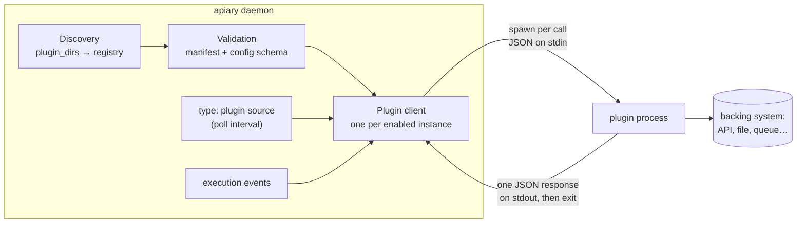

# Out-of-process plugins

Apiary protocol 1 runs third-party extensions as child processes instead of
loading Go binaries. A plugin crash, invalid response, or timeout terminates only
that invocation; it does not crash the dispatcher. Plugins are never executed
during discovery or configuration validation.

## Architecture

A plugin is an **executable file** (any language) installed in a directory
together with a manifest. The daemon never links against it and never keeps it
running: every call spawns a fresh process, writes one JSON request to its
stdin, reads one JSON response from its stdout, and the process exits.



The moving parts, in the order they run:

1. **Discovery** scans `plugin_dirs` for directories containing
   `apiary-plugin.json`, builds a registry, and rejects duplicate IDs. No
   plugin code executes during discovery.
2. **Validation** (`apiary validate`, `apiary plugins validate`, daemon
   startup) checks the manifest — schema version, semver compatibility with
   the host, protocol version, executable safety, checksum pin — and
   validates each enabled instance's `config` against the manifest's JSON
   Schema. Still no plugin code executes.
3. **Client creation** happens at daemon startup for every enabled instance
   whose manifest declares a capability the daemon integrates (see the
   [capability table](#protocol-version-1)). The client re-verifies the
   executable's checksum pin here and before every later invocation.
4. **Invocation** is where plugin code finally runs — see the lifecycle below.

### Invocation lifecycle

Each call is single-shot and stateless:

1. The client re-checks the pinned checksum (cheap `stat()` unless the file
   changed) and spawns the executable with a deadline (the instance's
   `timeout`, default 10s).
2. One compact JSON request — protocol version, request ID, capability,
   method, the instance's `config`, and the call payload — is written to the
   child's stdin, followed by a newline.
3. The plugin does its work (call an API, read a file …) and writes exactly
   one JSON response to stdout, echoing the request ID. Diagnostics belong on
   stderr.
4. The client enforces the contract: protocol version match, request-ID echo,
   a single response object, stdout ≤ 4 MiB, stderr capture ≤ 64 KiB. The
   deadline kills the process; a crash, timeout, or malformed response fails
   only that invocation.

Because every call is a fresh process, **plugins hold no in-memory state
between calls**. State lives in the backing system the plugin fronts (or a
file it manages). This is what makes the isolation story simple — there is no
long-running sidecar to supervise, leak, or restart.

### Process environment

| Aspect | Behavior |
|---|---|
| Working directory | The **plugin's install directory**, not the project root — relative paths in plugin `config` resolve there, so prefer absolute paths |
| Environment | Minimal allowlist (`PATH`, `HOME`, `TMPDIR`, locale/timezone) plus only the variables named in the manifest's `security.secret_env` — daemon secrets never leak in by default |
| Identity | `APIARY_PLUGIN_ID` and `APIARY_PLUGIN_PROTOCOL` are always set |
| Configuration | Passed inside every request (`config` field) — never via environment or files |

### How capabilities integrate

| Capability | When the daemon invokes it |
|---|---|
| `source` | A `sources[]` entry with `type: plugin` bridges to the instance; the daemon calls `poll` on the source's `poll_interval` and forwards `acknowledge`/`write_result` after dispatch. Polling only — plugins never push into the daemon |
| `event_exporter` | Once per persisted (redacted) execution event |
| `runner`, `workflow_action`, `approval_provider`, `secret_provider` | Reserved: manifest and transport are stable, daemon integration not yet wired |

Failure semantics follow the integration point: a failed `poll` is logged and
retried on the next interval like any source poll error; a failed `export` is
logged and dropped. A plugin can never take the dispatcher down.

## Where plugins live

An installed plugin is **one directory per plugin**, named by its id, holding
exactly two things: the manifest and the executable it names.

```
<project>/
├── apiary.yaml
├── .env
└── .apiary/
    └── plugins/                          ← default search directory
        ├── dev.apiary.source-file/       ← one directory per plugin id
        │   ├── apiary-plugin.json        ← manifest
        │   └── apiary-plugin-source-file ← executable (chmod +x)
        └── com.example.nagios/
            ├── apiary-plugin.json
            └── nagios-source
```

The default search directory is `.apiary/plugins` **beside `apiary.yaml`**.
`plugin_dirs` replaces it; list several to layer scopes:

```yaml
plugin_dirs:
  - .apiary/plugins                  # project-local: plugins for this project only
  - ~/.local/share/apiary/plugins   # user-global: shared across your projects
  # - /opt/apiary/plugins           # system-wide: daemon-as-a-service installs
```

Relative entries resolve beside `apiary.yaml`. Discovery scans every listed
directory; a plugin id appearing in more than one is an error — Apiary never
picks a winner by path order. Keep the directories writable only by the
Apiary operator or service account: plugins run with the daemon's OS
permissions.

## Installing a plugin

Apiary has no plugin registry and never downloads plugins — installation is
placing files, deliberately. Using the bundled `source-file` reference plugin
as the example:

**1. Obtain the executable.** Build it from source or download a release from
the plugin's publisher, then verify the artifact out of band (checksum,
signature):

```bash
go build -o apiary-plugin-source-file ./src/examples/plugins/source-file
```

**2. Create the plugin's directory** under a searched location, named by the
plugin id, and copy in the manifest and executable:

```bash
mkdir -p .apiary/plugins/dev.apiary.source-file
cp apiary-plugin.json apiary-plugin-source-file .apiary/plugins/dev.apiary.source-file/
chmod +x .apiary/plugins/dev.apiary.source-file/apiary-plugin-source-file
```

**3. Check the installation** — discovery and manifest validation, no plugin
code executed:

```bash
apiary plugins list                # dev.apiary.source-file  1.0.0  enabled  source
apiary plugins inspect dev.apiary.source-file
apiary plugins validate
```

**4. Enable it in `apiary.yaml`.** Installation makes a plugin *available*;
only a `plugins:` entry makes it *run*:

```yaml
plugins:
  - id: dev.apiary.source-file
    enabled: true                 # omitted means true
    timeout: 5s                   # default: 10s, per invocation
    config:                       # validated against the manifest's config_schema
      path: /path/to/project/.apiary/incoming-items.json
```

`apiary validate` now also validates this instance's `config` against the
manifest's JSON Schema. Set `enabled: false` to keep an installed plugin
configured but inert.

**5. Restart the daemon.** Plugin clients are created at startup; a plugin
installed or reconfigured while the daemon runs is picked up on the next
start.

To **upgrade**, verify the new artifact in a staging directory, stop Apiary,
replace the whole plugin directory atomically, run `apiary plugins validate`,
and restart (details under [Trust and secrets](#trust-and-secrets)). To
**uninstall**, remove the `plugins:` entry (or set `enabled: false`) and
delete the plugin's directory.

## Manifest version 1

```json
{
  "schema_version": 1,
  "id": "dev.apiary.event-file",
  "version": "1.0.0",
  "apiary": ">= 0.10.0-0",
  "protocol": 1,
  "executable": "apiary-plugin-event-file",
  "capabilities": ["event_exporter"],
  "config_schema": {
    "type": "object",
    "properties": {"path": {"type": "string", "minLength": 1}},
    "required": ["path"],
    "additionalProperties": false
  },
  "security": {
    "network": false,
    "read_paths": [],
    "write_paths": ["configured event file"],
    "secret_env": []
  }
}
```

- `id` is a lowercase reverse-DNS identifier and is stable across releases.
- `version` follows semantic versioning; `apiary` is a semantic-version constraint.
- `protocol` must be `1`. Unknown manifest/protocol versions fail closed.
- `executable` is relative to the plugin directory. Absolute paths, traversal,
  symlinks, non-regular files, and non-executable files are rejected.
- `checksum` (optional) pins the SHA-256 of the executable, as `sha256:<hex>` or
  bare hex. When present it is verified when the plugin client is created and
  again before each invocation, so a binary replaced after installation is rejected.
  A malformed value is an error rather than being treated as unpinned, so
  `apiary validate` catches a bad pin. This is **tamper-evidence, not
  authenticity**: the digest lives beside the binary, so anyone able to rewrite
  the executable can rewrite the pin too. It detects accidental drift and
  unsophisticated swaps, not a determined attacker with write access.
- `capabilities` accepts `source`, `runner`, `workflow_action`,
  `approval_provider`, `secret_provider`, and `event_exporter`.
- `config_schema` supports `type`, `properties`, `required`,
  `additionalProperties`, `enum`, `items`, `minLength`, `maxLength`, `minimum`,
  `maximum`, `minItems`, and `maxItems`. Unknown validation keywords fail closed.
- `security` is an inspectable declaration, not an OS sandbox guarantee.

## Protocol version 1

The transport is plain **stdin/stdout**. From the plugin's point of view, one
invocation is:

1. Apiary starts your executable (fresh process, every time).
2. Your **stdin** receives exactly one JSON object followed by a newline, then
   stdin is closed. Read it to EOF and decode it — no framing, no length
   prefix, no second request will ever arrive.
3. Do the work.
4. Write exactly **one** JSON object to **stdout** — the response — and exit
   `0`. Nothing else may go to stdout: a log line, a progress dot, or a second
   JSON object makes the whole invocation fail as a malformed response.
5. Anything you want to say for humans (debug output, warnings) goes to
   **stderr**. Apiary captures up to 64 KiB of it and attaches it to error
   messages; it is ignored on success.

In shell terms, Apiary is doing the equivalent of:

```bash
echo '<request JSON>' | ./your-plugin > response.json 2> diagnostics.log
```

Limits: stdout ≤ 4 MiB, captured stderr ≤ 64 KiB, wall-clock capped by the
instance's `timeout` (default 10s) — the deadline kills the process and fails
that invocation. Exiting non-zero also fails the invocation, even if a
response was written.

### The request you receive

```json
{
  "protocol": 1,
  "request_id": "1784736000000000000",
  "capability": "event_exporter",
  "method": "export",
  "config": {"path": ".apiary/events.jsonl"},
  "payload": {"schema_version": 1, "type": "runner.started"}
}
```

| Field | What to do with it |
|---|---|
| `protocol` | Refuse anything other than `1` with an `error` response |
| `request_id` | Echo it verbatim in your response — Apiary rejects a mismatch |
| `capability` / `method` | Select the operation; unknown combinations deserve an `error` with code `unsupported_method` |
| `config` | Your instance's `config:` block from `apiary.yaml`, passed on every call — plugins get no other configuration channel |
| `payload` | The method's input (shape per capability, e.g. [source methods](#source-plugins)); may be absent |

### The response you send

Exactly one of `result` or `error`, always echoing `protocol` and
`request_id`:

```json
{"protocol": 1, "request_id": "1784736000000000000", "result": {"written": true}}
```

```json
{"protocol": 1, "request_id": "1784736000000000000", "error": {"code": "write_failed", "message": "permission denied"}}
```

An `error` needs both a non-empty machine-readable `code` and a human
`message`; a response carrying both `result` and `error`, or neither, is
malformed.

### A complete plugin in 20 lines

The contract is small enough that this Python script is a valid plugin — it
answers `source.poll` with one hard-coded item:

```python
#!/usr/bin/env python3
import json, sys

req = json.load(sys.stdin)                      # 1. read the single request

def respond(result=None, error=None):           # 4. one response object, stdout
    print(json.dumps({"protocol": 1, "request_id": req["request_id"],
                      **({"result": result} if error is None else {"error": error})}))

if req["protocol"] != 1:
    respond(error={"code": "unsupported_protocol", "message": "expected protocol 1"})
elif req["capability"] == "source" and req["method"] == "poll":
    print("polling upstream...", file=sys.stderr)   # diagnostics → stderr only
    respond({"items": [{"id": "py-1", "title": "Hello from Python",
                        "labels": ["origin:python"], "state": "open"}]})
elif req["capability"] == "source" and req["method"] in ("acknowledge", "write_result"):
    respond({"ok": True})
else:
    respond(error={"code": "unsupported_method",
                   "message": f"unknown {req['capability']}.{req['method']}"})
```

Make it executable, name it in a manifest with `"capabilities": ["source"]`,
and it installs like any other plugin. Go authors get all of the envelope
handling for free from the SDK — see below.

Capability method vocabulary:

| Capability | Protocol methods |
|---|---|
| `source` | `poll`, `acknowledge`, `write_result` (see [Source plugins](#source-plugins)) |
| `runner` | `configure`, `run` |
| `workflow_action` | `run` |
| `approval_provider` | `notify`, `remind`, `escalate` |
| `secret_provider` | `resolve` |
| `event_exporter` | `export` |

Protocol envelopes are stable; capability payloads use the corresponding
versioned Apiary internal contract. The runtime integrations are
`event_exporter` and `source`. The remaining capability names reserve the same
manifest and transport boundary for their proxies without requiring a new
installation model.

## Source plugins

A `source`-capable plugin is a **poll-mode work source**: the daemon bridges a
`type: plugin` entry in `sources:` to one enabled plugin instance and invokes
it on the source's `poll_interval` — plugins never push into the daemon.

```yaml
plugins:
  - id: com.example.nagios
    timeout: 10s
    config:
      api_url: https://nagios.internal/api

sources:
  - id: nagios-alerts
    type: plugin
    poll_interval: 30s
    config:
      plugin: com.example.nagios   # the plugin instance to bridge
    filters:
      labels: ["severity=critical"]
```

Methods (wire types in `sdk/plugin/source.go`):

| Method | Payload → result |
|---|---|
| `poll` | `{since, states, labels}` → `{items: [...]}` — the current work items; `states`/`labels` are the source's `filters`, forwarded for backend-side filtering |
| `acknowledge` | `{item, action}` → `{ok: true}` — called after dispatch; return ok if there is nothing to mark |
| `write_result` | `{item, success, output, error}` → `{ok: true}` — the run outcome; return ok if there is no result surface |

Each item's `id` is the dedup key: keep it stable per dispatch-worthy
occurrence and re-return ongoing items on every poll — the daemon's
task/instance dedup prevents re-dispatch, exactly as for the in-tree
monitoring sources. Items without an `id` are dropped. Timestamps are RFC3339
strings; `labels` use `key:value` form and drive workflow trigger matching.

Plugin-backed sources are **read-only**: they cannot host approval steps, CI
waits, `set_state`, or label write-back — `apiary validate` rejects workflows
that require those against a `type: plugin` source. Publish findings to a
ticket source (`APIARY_PUBLISH` / `APIARY_SPAWN`) instead.

Go plugin authors can import `github.com/orlandoburli/apiary/sdk/plugin` and call
`plugin.Main(handler)`. The SDK decodes one request, rejects protocol mismatches,
echoes the request ID, and emits the structured response envelope. Plugins in
other languages implement the JSON contract directly — the
[Plugin SDK page](plugin-sdk.md) has the full Go reference plus verified
Python, Rust, and Bash examples.

## Trust and secrets

Plugins execute with the Apiary service account's OS permissions. Before install:

1. Obtain the binary from a trusted publisher.
2. Verify its checksum and signature out of band.
3. Inspect the manifest's network, path, and secret requirements.
4. Install into a directory writable only by the Apiary operator/service account.

Apiary does not download or auto-upgrade plugins. Upgrade atomically by verifying
the new artifact in a staging directory, stopping Apiary, replacing the complete
plugin directory, running `apiary plugins validate`, and restarting. Keep the old
directory for rollback, but never leave two versions with the same ID in searched
directories.

Child processes receive a minimal environment (`PATH`, home/temp/locale/timezone)
plus only variables listed in `security.secret_env`. Secret values are never
included in protocol requests or error messages. Plugin configuration should
contain references or non-secret options, not credentials. Event exporters
receive the persisted event after Apiary's metadata redaction.

Process isolation is not a security sandbox: a malicious executable can still use
the service account's filesystem and network access. Use OS-level sandboxing,
containers, restricted service users, and egress controls where the trust level
requires them.

## Reference plugins

`src/examples/plugins/event-file` demonstrates an `event_exporter` that appends one
redacted event JSON object per line. `src/examples/plugins/source-file`
demonstrates a `source` plugin that polls work items from a JSON file. Each
README contains build and installation commands.
