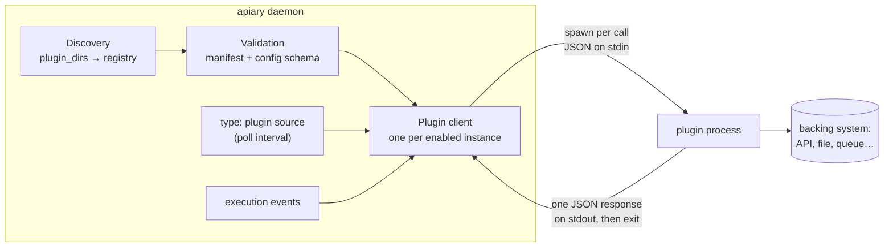

# Out-of-process plugins

Apiary protocol 1 runs third-party extensions as child processes instead of
loading Go binaries. A plugin crash, invalid response, or timeout terminates only
that invocation; it does not crash the dispatcher. Plugins are never executed
during discovery or configuration validation.

## Architecture

A plugin is an **executable file** (any language) installed in a directory
together with a manifest. The daemon never links against it and never keeps it
running: every call spawns a fresh process, writes one JSON request to its
stdin, reads one JSON response from its stdout, and the process exits.



The moving parts, in the order they run:

1. **Discovery** scans `plugin_dirs` for directories containing
   `apiary-plugin.json`, builds a registry, and rejects duplicate IDs. No
   plugin code executes during discovery.
2. **Validation** (`apiary validate`, `apiary plugins validate`, daemon
   startup) checks the manifest — schema version, semver compatibility with
   the host, protocol version, executable safety, checksum pin — and
   validates each enabled instance's `config` against the manifest's JSON
   Schema. Still no plugin code executes.
3. **Client creation** happens at daemon startup for every enabled instance
   whose manifest declares a capability the daemon integrates (see the
   [capability table](#protocol-version-1)). The client re-verifies the
   executable's checksum pin here and before every later invocation.
4. **Invocation** is where plugin code finally runs — see the lifecycle below.

### Invocation lifecycle

Each call is single-shot and stateless:

1. The client re-checks the pinned checksum (cheap `stat()` unless the file
   changed) and spawns the executable with a deadline (the instance's
   `timeout`, default 10s).
2. One compact JSON request — protocol version, request ID, capability,
   method, the instance's `config`, and the call payload — is written to the
   child's stdin, followed by a newline.
3. The plugin does its work (call an API, read a file …) and writes exactly
   one JSON response to stdout, echoing the request ID. Diagnostics belong on
   stderr.
4. The client enforces the contract: protocol version match, request-ID echo,
   a single response object, stdout ≤ 4 MiB, stderr capture ≤ 64 KiB. The
   deadline kills the process; a crash, timeout, or malformed response fails
   only that invocation.

Because every call is a fresh process, **plugins hold no in-memory state
between calls**. State lives in the backing system the plugin fronts (or a
file it manages). This is what makes the isolation story simple — there is no
long-running sidecar to supervise, leak, or restart.

### Process environment

| Aspect | Behavior |
|---|---|
| Working directory | The **plugin's install directory**, not the project root — relative paths in plugin `config` resolve there, so prefer absolute paths |
| Environment | Minimal allowlist (`PATH`, `HOME`, `TMPDIR`, locale/timezone) plus only the variables named in the manifest's `security.secret_env` — daemon secrets never leak in by default |
| Identity | `APIARY_PLUGIN_ID` and `APIARY_PLUGIN_PROTOCOL` are always set |
| Configuration | Passed inside every request (`config` field) — never via environment or files |

### How capabilities integrate

| Capability | When the daemon invokes it |
|---|---|
| `source` | A `sources[]` entry with `type: plugin` bridges to the instance; the daemon calls `poll` on the source's `poll_interval` and forwards `acknowledge`/`write_result` after dispatch. Polling only — plugins never push into the daemon |
| `event_exporter` | Once per persisted (redacted) execution event |
| `runner`, `workflow_action`, `approval_provider`, `secret_provider` | Reserved: manifest and transport are stable, daemon integration not yet wired |

Failure semantics follow the integration point: a failed `poll` is logged and
retried on the next interval like any source poll error; a failed `export` is
logged and dropped. A plugin can never take the dispatcher down.

## Where plugins live

An installed plugin is **one directory per plugin**, named by its id, holding
exactly two things: the manifest and the executable it names.

```
<project>/
├── apiary.yaml
├── .env
└── .apiary/
    └── plugins/                          ← default search directory
        ├── dev.apiary.source-file/       ← one directory per plugin id
        │   ├── apiary-plugin.json        ← manifest
        │   └── apiary-plugin-source-file ← executable (chmod +x)
        └── com.example.nagios/
            ├── apiary-plugin.json
            └── nagios-source
```

The default search directory is `.apiary/plugins` **beside `apiary.yaml`**.
`plugin_dirs` replaces it; list several to layer scopes:

```yaml
plugin_dirs:
  - .apiary/plugins                  # project-local: plugins for this project only
  - ~/.local/share/apiary/plugins   # user-global: shared across your projects
  # - /opt/apiary/plugins           # system-wide: daemon-as-a-service installs
```

Relative entries resolve beside `apiary.yaml`. Discovery scans every listed
directory; a plugin id appearing in more than one is an error — Apiary never
picks a winner by path order. Keep the directories writable only by the
Apiary operator or service account: plugins run with the daemon's OS
permissions.

## Installing a plugin

Installation is placing files, deliberately — `apiary plugins install` does that
for you and verifies what it places, or you do it by hand. Either way the daemon
never downloads anything, nothing is enabled without an edit you make, and the
files land in the same place.

### From the registry

```bash
apiary plugins search cron                       # find one
apiary plugins info dev.apiary.routines          # read what it declares
apiary plugins install dev.apiary.routines       # verify, confirm, place the files
```

`install` resolves the release for this host — version constraint, protocol,
platform, withdrawals — **before** downloading, then verifies the archive's
digest against the registry's, unpacks it into a staging directory outside every
searched path, validates the manifest, confirms the archive holds the plugin you
asked for, and verifies the executable's digest. Only then does it print what it
is about to install and ask:

```text
dev.apiary.routines 0.1.0  (source)
  from     https://github.com/orlandoburli/apiary-routines/releases/download/v0.1.0/…tar.gz
  sha256   efb15a92…405f64d7 (verified)
  registry https://orlandoburli.com.br/apiary/registry/v1/index.json (signature verified)
  conformance  FAILED the protocol kit in registry CI — expect protocol bugs
  pinned   f4d0c199…52b709f6 (from the registry, not from the archive)

  Declared access (a declaration, not a sandbox):
    network      no
    read paths   configured state_file
    write paths  configured state_file
    secret env   (none)

  This executable will run with the daemon's OS permissions, as its user.
  A registry listing is a pointer to someone else's repository — it is not an
  endorsement, and Apiary has not reviewed this code.

Install into .apiary/plugins? [y/N]
```

That conformance line is real, and worth reading rather than skimming: registry
CI ran the [conformance kit](plugin-sdk.md#the-conformance-kit) against this
published binary and it failed three cases. A failure does not block a listing or
an install — the registry describes plugins, it does not certify them — but it
does tell you to expect protocol-level rough edges.

`--yes` skips the prompt, not the summary. Other flags: `--dir` to choose which
searched directory to install into (default: the first `plugin_dirs` entry),
`--sha256` to cross-check the archive digest you were told to expect against the
registry's (a disagreement stops the install before anything is downloaded),
`--registry` for a one-off index, `--offline` to use the cached index.

The commit is a single atomic rename: until you answer the prompt, nothing
exists in any directory the daemon searches.

**Pinning.** If the publisher's manifest carries no `checksum`, the installer
writes the registry's executable digest into it. This is the point of installing
from a registry rather than by hand: the pin now originates in a repository the
publisher does not control, so the per-invocation integrity check compares
against a value they cannot quietly rewrite. `apiary plugins validate` re-derives
it too, so a swapped binary is caught by a command rather than at 3am. A
publisher pin that disagrees with the registry aborts the install.

### By hand

The manual procedure needs no network and no registry, and stays fully
supported. Using the bundled `source-file` reference plugin as the example:

**1. Obtain the executable.** Build it from source or download a release from
the plugin's publisher, then verify the artifact out of band (checksum,
signature):

```bash
(cd src && go build -o ../apiary-plugin-source-file ./examples/plugins/source-file)
```

**2. Create the plugin's directory** under a searched location, named by the
plugin id, and copy in the manifest and executable:

```bash
mkdir -p .apiary/plugins/dev.apiary.source-file
cp apiary-plugin.json apiary-plugin-source-file .apiary/plugins/dev.apiary.source-file/
chmod +x .apiary/plugins/dev.apiary.source-file/apiary-plugin-source-file
```

**3. Check the installation** — discovery and manifest validation, no plugin
code executed:

```bash
apiary plugins list                # dev.apiary.source-file  1.0.0  enabled  source
apiary plugins inspect dev.apiary.source-file
apiary plugins validate
```

### Enabling it (either way)

**4. Enable it in `apiary.yaml`.** Installation makes a plugin *available*;
only a `plugins:` entry makes it *run*. `apiary plugins install` prints this
snippet, seeded with the config keys the manifest requires — it never edits your
config itself:

```yaml
plugins:
  - id: dev.apiary.source-file
    enabled: true                 # omitted means true
    timeout: 5s                   # default: 10s, per invocation
    config:                       # validated against the manifest's config_schema
      path: /path/to/project/.apiary/incoming-items.json
```

`apiary validate` now also validates this instance's `config` against the
manifest's JSON Schema. Set `enabled: false` to keep an installed plugin
configured but inert.

**5. Restart the daemon.** Plugin clients are created at startup; a plugin
installed or reconfigured while the daemon runs is picked up on the next
start.

### Upgrading and uninstalling

```bash
apiary plugins upgrade dev.apiary.routines             # same checks, then swap
apiary plugins upgrade dev.apiary.routines --rollback  # restore the kept version
apiary plugins uninstall dev.apiary.routines
```

`upgrade` runs the full verification, sets the current version aside as
`<id>.bak` (one generation), and commits the new one; if the result does not
validate, the previous version is restored automatically. A running daemon keeps
the version it started with until you restart it.

`uninstall` removes the directory and refuses while the plugin is still enabled
in `apiary.yaml` (`--force` overrides). It never edits your config — a `plugins:`
entry pointing at an uninstalled id is already a clear `apiary validate` error.

By hand, the equivalent is: verify the new artifact in a staging directory, stop
Apiary, replace the whole plugin directory atomically, run
`apiary plugins validate`, and restart (details under
[Trust and secrets](#trust-and-secrets)). To uninstall, remove the `plugins:`
entry (or set `enabled: false`) and delete the plugin's directory.

### Registries and mirrors

`plugin_registries` lists the indexes `search`, `info` and `install` resolve
names against. Unset means the official index; each entry is a URL, or a mapping
that pins that registry to a signing key:

```yaml
plugin_registries:
  # The official index, verified against the key built into the binary.
  - https://orlandoburli.com.br/apiary/registry/v1/index.json
  # An internal mirror, verified against a key this organisation controls.
  - url: file:///opt/apiary/registry/index.json
    public_key: RWQf6LRCGA9i53mlYecO4IzT51TGPpvWucNSCh1CBM0QTaLn73Y7GFO3
```

Registries are consulted in order and the first hit wins, so a mirror listed
first deliberately shadows the official index. Only `https://` and `file://` are
accepted: digests protect the payload, but nothing protects a plaintext
resolution. `plugin_registries: []` disables the registry entirely, leaving
manual installation. The daemon never reads any of this — registry access is a
CLI concern.

The index is signed with [minisign](https://jedisct1.github.io/minisign/) and
verified before it is parsed; the local cache is verified on read too, so a cache
poisoned on disk is caught rather than served. **Once a key is pinned there is no
way to skip verification** — no flag, no environment variable. When no key is
available for a registry, commands print
`! … is not signature-verified (no public key pinned for it)` rather than letting
an unverified index read as a checked one.

Signing covers the index, which carries the digests, which cover the artifacts.
It does not authenticate plugin publishers; artifact signing is a separate
problem and is not solved here.

For air-gapped installs, use a `file://` mirror or `--offline`, which uses the
cached index and never touches the network.

## Manifest version 1

```json
{
  "schema_version": 1,
  "id": "dev.apiary.event-file",
  "version": "1.0.0",
  "apiary": ">= 0.10.0-0",
  "protocol": 1,
  "executable": "apiary-plugin-event-file",
  "capabilities": ["event_exporter"],
  "config_schema": {
    "type": "object",
    "properties": {"path": {"type": "string", "minLength": 1}},
    "required": ["path"],
    "additionalProperties": false
  },
  "security": {
    "network": false,
    "read_paths": [],
    "write_paths": ["configured event file"],
    "secret_env": []
  }
}
```

- `id` is a lowercase reverse-DNS identifier and is stable across releases.
- `version` follows semantic versioning; `apiary` is a semantic-version constraint.
- `protocol` must be `1`. Unknown manifest/protocol versions fail closed.
- `executable` is relative to the plugin directory. Absolute paths, traversal,
  symlinks, non-regular files, and non-executable files are rejected.
- `checksum` (optional) pins the SHA-256 of the executable, as `sha256:<hex>` or
  bare hex. When present it is verified when the plugin client is created and
  again before each invocation, so a binary replaced after installation is rejected.
  A malformed value is an error rather than being treated as unpinned, so
  `apiary validate` catches a bad pin, and both `apiary validate` and
  `apiary plugins validate` re-derive the digest to catch a binary that changed
  after installation. When the publisher ships no pin, `apiary plugins install`
  writes the registry's digest here. A publisher-written pin is
  **tamper-evidence, not authenticity**: the digest lives beside the binary, so
  anyone able to rewrite the executable can rewrite the pin too — it detects
  accidental drift and unsophisticated swaps, not a determined attacker with
  write access. An installer-injected pin originates outside the publisher's own
  release, which is what makes it a supply-chain check rather than a drift
  check.
- `capabilities` accepts `source`, `runner`, `workflow_action`,
  `approval_provider`, `secret_provider`, and `event_exporter`.
- `config_schema` supports `type`, `properties`, `required`,
  `additionalProperties`, `enum`, `items`, `minLength`, `maxLength`, `minimum`,
  `maximum`, `minItems`, and `maxItems`. Unknown validation keywords fail closed.
- `security` is an inspectable declaration, not an OS sandbox guarantee.

## Protocol version 1

The transport is plain **stdin/stdout**. From the plugin's point of view, one
invocation is:

1. Apiary starts your executable (fresh process, every time).
2. Your **stdin** receives exactly one JSON object followed by a newline, then
   stdin is closed. Read it to EOF and decode it — no framing, no length
   prefix, no second request will ever arrive.
3. Do the work.
4. Write exactly **one** JSON object to **stdout** — the response — and exit
   `0`. Nothing else may go to stdout: a log line, a progress dot, or a second
   JSON object makes the whole invocation fail as a malformed response.
5. Anything you want to say for humans (debug output, warnings) goes to
   **stderr**. Apiary captures up to 64 KiB of it and attaches it to error
   messages; it is ignored on success.

In shell terms, Apiary is doing the equivalent of:

```bash
echo '<request JSON>' | ./your-plugin > response.json 2> diagnostics.log
```

Limits: stdout ≤ 4 MiB, captured stderr ≤ 64 KiB, wall-clock capped by the
instance's `timeout` (default 10s) — the deadline kills the process and fails
that invocation. Exiting non-zero also fails the invocation, even if a
response was written.

### The request you receive

```json
{
  "protocol": 1,
  "request_id": "1784736000000000000",
  "capability": "event_exporter",
  "method": "export",
  "config": {"path": ".apiary/events.jsonl"},
  "payload": {"schema_version": 1, "type": "runner.started"}
}
```

| Field | What to do with it |
|---|---|
| `protocol` | Refuse anything other than `1` with an `error` response |
| `request_id` | Echo it verbatim in your response — Apiary rejects a mismatch |
| `capability` / `method` | Select the operation; unknown combinations deserve an `error` with code `unsupported_method` |
| `config` | Your instance's `config:` block from `apiary.yaml`, passed on every call — plugins get no other configuration channel |
| `payload` | The method's input (shape per capability, e.g. [source methods](#source-plugins)); may be absent |

### The response you send

Exactly one of `result` or `error`, always echoing `protocol` and
`request_id`:

```json
{"protocol": 1, "request_id": "1784736000000000000", "result": {"written": true}}
```

```json
{"protocol": 1, "request_id": "1784736000000000000", "error": {"code": "write_failed", "message": "permission denied"}}
```

An `error` needs both a non-empty machine-readable `code` and a human
`message`; a response carrying both `result` and `error`, or neither, is
malformed.

### A complete plugin in 20 lines

The contract is small enough that this Python script is a valid plugin — it
answers `source.poll` with one hard-coded item:

```python
#!/usr/bin/env python3
import json, sys

req = json.load(sys.stdin)                      # 1. read the single request

def respond(result=None, error=None):           # 4. one response object, stdout
    print(json.dumps({"protocol": 1, "request_id": req["request_id"],
                      **({"result": result} if error is None else {"error": error})}))

if req["protocol"] != 1:
    respond(error={"code": "unsupported_protocol", "message": "expected protocol 1"})
elif req["capability"] == "source" and req["method"] == "poll":
    print("polling upstream...", file=sys.stderr)   # diagnostics → stderr only
    respond({"items": [{"id": "py-1", "title": "Hello from Python",
                        "labels": ["origin:python"], "state": "open"}]})
elif req["capability"] == "source" and req["method"] in ("acknowledge", "write_result"):
    respond({"ok": True})
else:
    respond(error={"code": "unsupported_method",
                   "message": f"unknown {req['capability']}.{req['method']}"})
```

Make it executable, name it in a manifest with `"capabilities": ["source"]`,
and it installs like any other plugin. Go and Python authors get all of the
envelope handling for free from the [official SDKs](plugin-sdk.md), and any
plugin — hand-rolled or not — can be checked against the
[conformance kit](plugin-sdk.md#the-conformance-kit).

Capability method vocabulary:

| Capability | Protocol methods |
|---|---|
| `source` | `poll`, `acknowledge`, `write_result` (see [Source plugins](#source-plugins)) |
| `runner` | `configure`, `run` |
| `workflow_action` | `run` |
| `approval_provider` | `notify`, `remind`, `escalate` |
| `secret_provider` | `resolve` |
| `event_exporter` | `export` |

Protocol envelopes are stable; capability payloads use the corresponding
versioned Apiary internal contract. The runtime integrations are
`event_exporter` and `source`. The remaining capability names reserve the same
manifest and transport boundary for their proxies without requiring a new
installation model.

## Source plugins

A `source`-capable plugin is a **poll-mode work source**: the daemon bridges a
`type: plugin` entry in `sources:` to one enabled plugin instance and invokes
it on the source's `poll_interval` — plugins never push into the daemon.

```yaml
plugins:
  - id: com.example.nagios
    timeout: 10s
    config:
      api_url: https://nagios.internal/api

sources:
  - id: nagios-alerts
    type: plugin
    poll_interval: 30s
    config:
      plugin: com.example.nagios   # the plugin instance to bridge
    filters:
      labels: ["severity=critical"]
```

`plugin` is the **only** key the source entry accepts, and `apiary validate`
rejects any other: the bridge forwards nothing from here to the plugin process.
The plugin's own settings belong under `plugins[].config`, where they are
checked against the manifest's JSON schema — a setting written on the source
entry would be silently dropped.

Methods (wire types in `sdk/plugin/source.go`):

| Method | Payload → result |
|---|---|
| `poll` | `{since, states, labels}` → `{items: [...]}` — the current work items; `states`/`labels` are the source's `filters`, forwarded for backend-side filtering |
| `acknowledge` | `{item, action}` → `{ok: true}` — called after dispatch; return ok if there is nothing to mark |
| `write_result` | `{item, success, output, error}` → `{ok: true}` — the run outcome; return ok if there is no result surface |

Each item's `id` is the dedup key: keep it stable per dispatch-worthy
occurrence and re-return ongoing items on every poll — the daemon's
task/instance dedup prevents re-dispatch, exactly as for the in-tree
monitoring sources. Items without an `id` are dropped. Timestamps are RFC3339
strings; `labels` use `key:value` form and drive workflow trigger matching.

Plugin-backed sources are **read-only**: they cannot host approval steps, CI
waits, `set_state`, or label write-back — `apiary validate` rejects workflows
that require those against a `type: plugin` source. Publish findings to a
ticket source (`APIARY_PUBLISH` / `APIARY_SPAWN`) instead.

Go plugin authors can `go get github.com/orlandoburli/apiary/sdk` — a
standalone, standard-library-only module, tagged `sdk/vX.Y.Z` independently of
the daemon — then import `github.com/orlandoburli/apiary/sdk/plugin` and call
`plugin.Main(handler)`. The SDK decodes one request, rejects protocol mismatches,
echoes the request ID, and emits the structured response envelope. Plugins in
other languages implement the JSON contract directly — the
[Plugin SDK page](plugin-sdk.md) has the full Go reference plus verified
Python, Rust, and Bash examples.

## Trust and secrets

Plugins execute with the Apiary service account's OS permissions. Before install:

1. Obtain the binary from a trusted publisher — read the code you are about to
   run as that account. A registry listing is a pointer to someone else's
   repository, reviewed but not endorsed, and never a substitute for this.
2. Verify its provenance. `apiary plugins install` does the mechanical part:
   digests checked before unpacking, manifest cross-checked against the listing,
   executable pinned. Installing by hand means doing it out of band yourself.
3. Inspect the manifest's network, path, and secret requirements — `install`
   prints them and waits for you; `apiary plugins inspect` shows them any time.
4. Install into a directory writable only by the Apiary operator/service account.

**How far the checks reach.** Signature verification covers the registry index,
which carries the digests, which cover the artifacts. It does not authenticate
plugin publishers, and it says nothing about what a plugin does with the access
it declares. A `checksum` the publisher wrote is tamper-evidence only — the pin
lives beside the binary, so anyone who can rewrite one can rewrite the other. A
pin *injected at install* comes from the registry repository instead, which is a
meaningfully stronger claim, but still one about bytes, not about intent.

The daemon never contacts a registry, never downloads, and never auto-upgrades:
every one of those is a command you run. Upgrade with
`apiary plugins upgrade`, which stages, verifies, keeps one generation as
`<id>.bak`, and restores it if the new copy fails to validate — or, by hand,
verify the new artifact in a staging directory, stop Apiary, replace the complete
plugin directory, run `apiary plugins validate`, and restart. Keep the old
directory for rollback, but never leave two versions with the same ID in searched
directories.

Child processes receive a minimal environment (`PATH`, home/temp/locale/timezone)
plus only variables listed in `security.secret_env`. Secret values are never
included in protocol requests or error messages. Plugin configuration should
contain references or non-secret options, not credentials. Event exporters
receive the persisted event after Apiary's metadata redaction.

Process isolation is not a security sandbox: a malicious executable can still use
the service account's filesystem and network access. Use OS-level sandboxing,
containers, restricted service users, and egress controls where the trust level
requires them.

## Reference plugins

For plugins you can install rather than copy, see the
[Plugin Directory](plugin-directory.md).

Each directory under `src/examples/plugins/` ships a manifest, a README with
build/install commands, and a complete plugin:

| Plugin | Language | Demonstrates |
|---|---|---|
| `event-file` | Go (SDK) | An `event_exporter` appending one redacted event JSON object per line |
| `source-file` | Go (SDK) | A `source` plugin polling work items from a JSON file |
| `source-bash` | Bash + jq | The same file-backed source as a shell script — no build step at all |
| `source-node` | TypeScript (Node) | The same file-backed source compiled with `tsc` to a shebang executable |

The three source plugins are behaviorally identical on purpose: diff them to
see the same contract expressed in each ecosystem.
