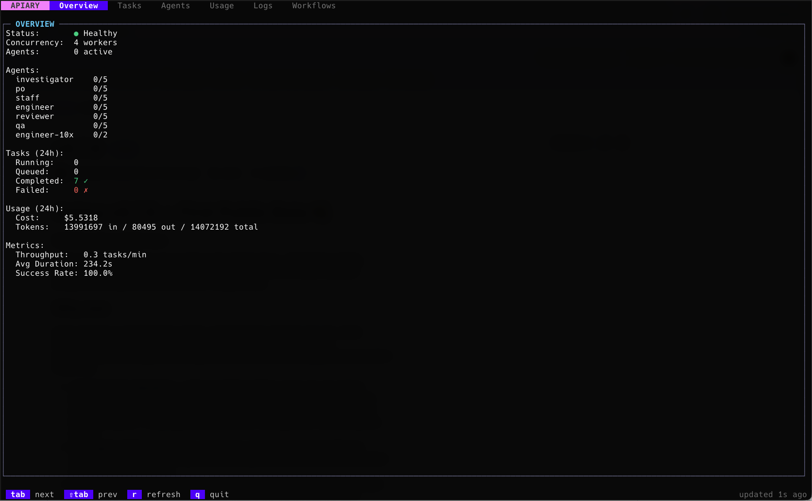
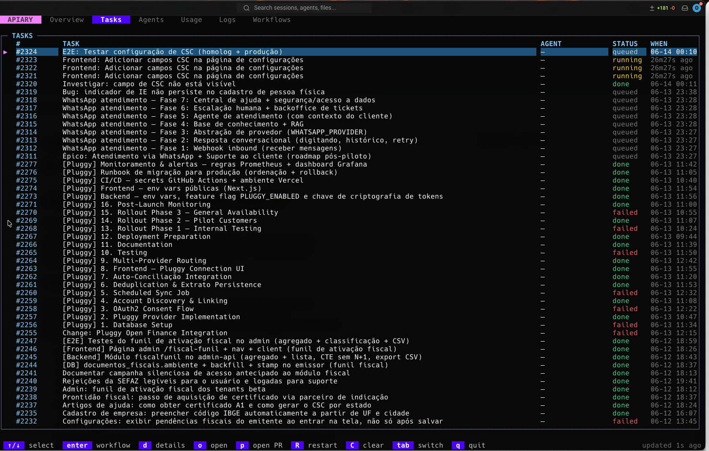
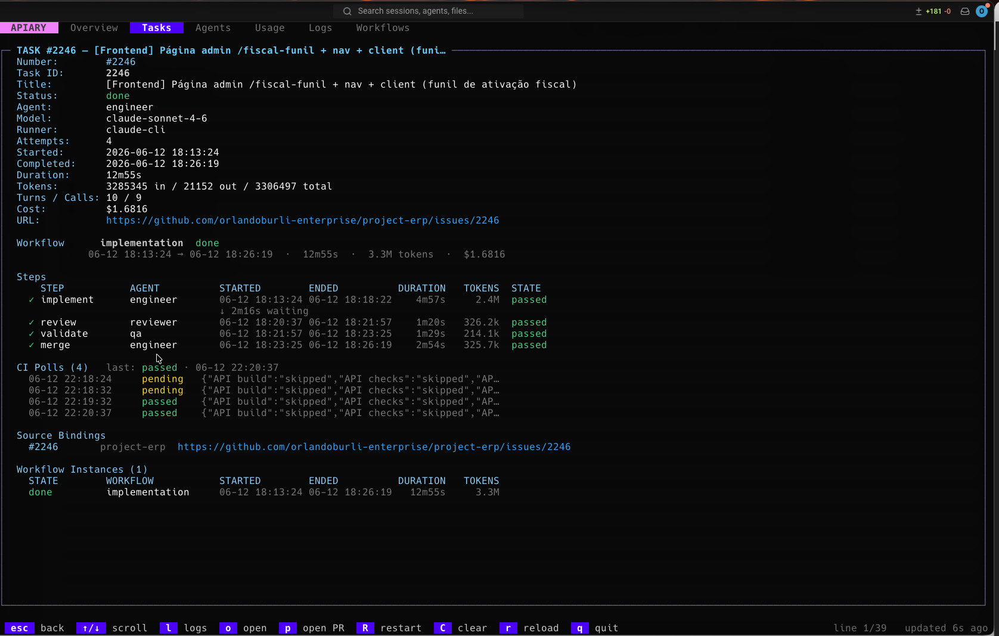
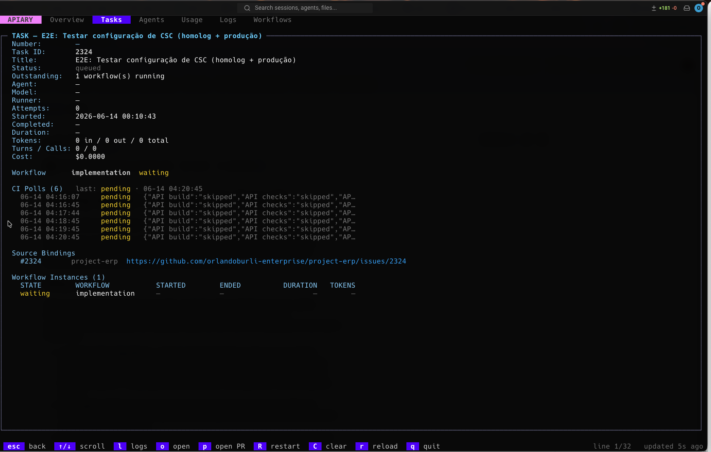
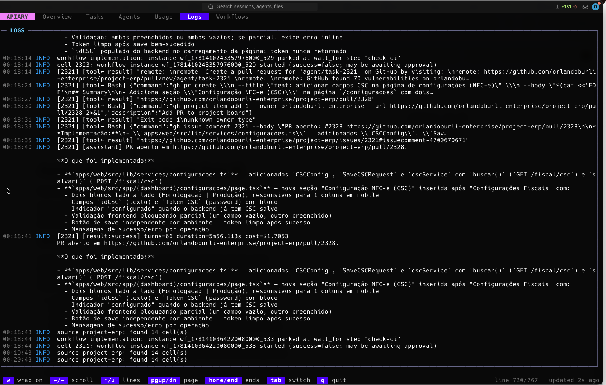

Title: Apiary: Autonomous AI dispatch for your backlog. No human dispatcher required.

Subtitle: After six months in production, Apiary v0.7.0 is the open-source harness that routes work from your issue tracker to the right AI agent and runs it unattended.

---

> **Publishing notes (delete before posting):**
>
> **Fresh Screenshots** (all from img/, captured June 14, 2026):
> 1. After "## The architecture": Use `overview.png`
> 2. After "### 4. Task spawning and fan-out": Use `task-detail.png`  
> 3. After "### 8. Dashboard & observability": Create a 4-image grid/carousel:
>    - `overview.png` (Overview tab - health, metrics, agents, costs)
>    - `tasks.png` (Tasks tab - live task list)
>    - `agents.png` (Agents tab - performance metrics)
>    - `logs.png` (Logs tab - daemon activity stream)
>
> **Optional additional screenshots** (to use in "Real-world scenarios" sections if desired):
> - `task-logs-detail.png` (detailed task execution logs)
> - `workflow-instance.png` (workflow instance view)
> - `step-execution.png` (step-by-step execution details)
>
> Cover image: Use `docs/logo.svg` on dark background, or screenshot the overview tab header
> Canonical link: github.com/orlandoburli/apiary
> Tags: `AI`, `Developer Tools`, `Open Source`, `Automation`, `LLM`, `DevOps`, `Agent Orchestration`

---

## The dispatcher problem

The last two years gave us incredible AI agents. Claude, OpenCode, Cursor — point one at a task and it writes code, runs tests, opens a PR. The technology is genuinely impressive.

But look closely at how teams actually deploy them, and there's a human trapped in the middle of every single run.

Someone reads the backlog. Someone decides *this* task is a good fit. Someone picks the model, pastes the context, kicks off a run, watches it go, and babysits the result. The agent is fully autonomous. The *dispatching* is entirely manual.

That human-in-the-middle isn't a bottleneck — it's *the* bottleneck. It doesn't scale. It doesn't run at 2am. It quietly caps how many tasks your agents can actually touch.

**Apiary closes that loop.**

---

## What Apiary is

Apiary is a small, self-hosted Go binary. You write one `apiary.yaml` file. It says:

- **Where work comes from:** "Poll GitHub Issues, Plane, Jira, or Linear for new tasks."
- **How to route:** "If this task has label `backend-bug`, route it to the debugging-expert agent on Claude. If it's labeled `refactor`, send it to the architect on OpenCode with a fallback to Cursor."
- **What to do with results:** "Close the issue, add a success label, post a comment with the summary."

Then you run `apiary daemon` and walk away. Tasks flow in from your issue tracker, get routed to the right agent and model with rules you define in YAML, and results flow back out automatically.

No SaaS. No database to stand up. No credentials passed around. State lives in one SQLite file next to your config. You own your data. You own your costs.

The dashboard shows real-time metrics: task throughput, success rate, active agents, and queue depth. Everything you need to know about your unattended dispatch at a glance.



---

## The architecture

```
Sources (GitHub, Plane, Jira)
        ↓ (polling)
    Router (workflow triggers)
        ↓ (matching)
    Workflow Engine (DAG executor)
        ↓ (dispatch)
    Runners (claude, opencode, cursor, API)
        ↓ (execution)
    Results written back (comments, labels, state)
```

The daemon does all the work. The dashboard (`apiary dashboard`) and CLI commands (`apiary status`, `apiary instances`, `apiary task`) are read-only windows into the same SQLite database.

---

## Core features

### 1. Multi-system source adapters

Work doesn't live in one place. Apiary sources can ingest tasks from multiple systems and route them through the same workflows.

#### GitHub Issues

Polls your repositories, reads issue labels, states, and comments. When a workflow completes, Apiary posts results back as comments and can update labels and close the issue.

```yaml
sources:
  - id: main-repo
    type: github
    config:
      repo: my-org/my-repo
      api_key: ${GITHUB_TOKEN}
    poll_interval: 120s
    filters:
      states: [open]
      labels: [ai-ready]    # only process tasks manually marked for agents
```

#### Plane

Full Plane integration with custom fields, status transitions, and real-time updates. Agents can update issue state as they progress.

```yaml
sources:
  - id: project-backlog
    type: plane
    config:
      workspace: my-workspace
      project: project-id
      api_key: ${PLANE_API_KEY}
    filters:
      states: [backlog, todo, in_progress]
```

#### Jira Cloud

JQL-based search, status automation, and blocking relationships. Apiary reads Jira's `Blocks` link type to understand dependencies.

```yaml
sources:
  - id: jira
    type: jira
    config:
      base_url: https://company.atlassian.net
      email: bot@company.com
      api_token: ${JIRA_API_TOKEN}
    filters:
      jql: 'labels = apiary AND statusCategory != Done'
```

**Note:** Each source can have its own filter rules. Tasks from different sources flow through the same routing logic and can fan out to any workflow.

---

### 2. Declarative multi-step workflows

A workflow is a pipeline of steps, fired when its trigger matches a task. Start simple — one step per agent — and scale to complex multi-stage coordination.

```yaml
workflows:
  - id: implement
    trigger:
      priority: 10
      match:
        source: github-repo
        labels: [feature]
    
    steps:
      - id: design-api
        agent: architect
        
      - id: implement-backend
        agent: engineer
        kind: dependency              # ← NEW: wait for upstream
        wait_for_task: design-api
        
      - id: write-tests
        agent: qa
        kind: dependency
        wait_for_task: implement-backend
        
      - id: review
        type: approval                # human gate
        on_reject:
          restart_from: implement-backend
          max: 3
    
    on_complete:
      set_state: closed
      set_labels: [done, verified]
```

#### What each step type does:

- **`type: agent`** — Dispatch to an agent. The agent runs the prompt, and everything it outputs is captured (logs, tokens, cost).
- **`type: wait_for`** — Park the workflow until a condition is met:
  - `kind: ci` — wait for GitHub checks to pass (active polling, survives daemon restarts)
  - `kind: dependency` — wait for an upstream task to complete (blocks dependent stages)
- **`type: approval`** — Park until a human reviews and approves or rejects. Includes timeout and notification hooks.
- **`type: split`** — Branch logic: evaluate a condition and pick a path.
- **`type: foreach`** — Iterate over an array of inputs (e.g., spawn multiple child tasks in parallel).

Every step's logs, tokens, and cost are recorded. The dashboard streams them live as the workflow executes.

**In the dashboard:** Every step's logs are streamed live. You see the agent's thinking, tool calls, errors, and exact token usage as it happens. Cache hits are highlighted separately from regular tokens.

---

### 3. Dependency blocking (v0.7.0 feature)

The headline feature: steps can now wait on their upstream dependencies. When a step declares `kind: dependency`, it blocks until a named upstream task completes.

```yaml
steps:
  - id: implement
    agent: engineer
    kind: dependency
    wait_for_task: design        # ← wait for the "design" step to finish
    on_timeout:
      hold                        # keep waiting (don't fail automatically)
```

Behind the scenes:

- Apiary reads Jira's `Blocks` link and GitHub's `blocked_by` relationships.
- When the upstream task completes, the downstream task auto-resumes.
- If the daemon restarts, the parked state survives — you don't lose your place.
- If upstream fails, downstream stays parked (doesn't cascade failures).

This unlocks **staged workflows**: design → implement → test → review, each with its own agent, each waiting for the previous stage to succeed.

---

### 4. Task spawning and fan-out

An agent isn't limited to answering its own task. From inside a run, it can **spawn child tasks** that drive their own workflows.

Example: a product-owner agent decomposes a spec into implementation tasks:

```
Initial issue: "Build billing module"
 ├─ Spawned task: "Create invoices table"  (spawned by the PO agent)
 ├─ Spawned task: "Implement invoices API"
 └─ Spawned task: "Wire dashboard UI"
```

The agent emits a marker:

```
APIARY_SPAWN_BEGIN
{"workflow": "implement", "title": "Create invoices table", "input": {...}, "key": "billing/table"}
APIARY_SPAWN_END
```

Each spawned task:
- Gets its own workflow instances
- Appears in the dashboard's task tree with lineage
- Can spawn its own children
- Is first-class for cost tracking and monitoring

**In the dashboard's Tasks tab:** The task tree is visible — parent at the top, spawned children below, with lineage lines showing the relationships. Each child has its own workflow instances and cost tracking. Click on a task to see full detail: status, agent, model, number of attempts, exact start/end times, duration, and a direct link back to the source issue.




---

### 5. Persistent agent memory

By default, agents are stateless. An agent that solved a problem yesterday doesn't remember it today.

**Agent memory** (opt-in) adds two persistent tiers:

#### Task memory

Working notes attached to a task. Survives retries, fan-out instances, and the spawned child tree. Agents write task notes via `APIARY_MEMORIZE`:

```
APIARY_MEMORIZE_BEGIN
{
  "scope": "task",
  "content": "The build issue is in the Makefile. Tried three approaches:\n1. Upgrade gcc (blocked by CI)\n2. Add -fPIC flag (broken on ARM)\n3. Switch to clang (works, now testing)"
}
APIARY_MEMORIZE_END
```

When the task retries, the next agent sees this context injected into its prompt. No need to re-investigate.

#### Global memory

Durable facts saved once, used forever. Examples:

```json
{
  "scope": "global",
  "name": "project-convention-import-order",
  "description": "Python imports must be sorted: stdlib, third-party, local (isort profile black)",
  "content": "Enforced by pre-commit hook. Breaking this fails the linter..."
}
```

Global facts are indexed in a `MEMORY.md` and injected into every agent step (with a configurable budget so they don't bloat your prompts).

Enable it:

```yaml
settings:
  memory:
    enabled: true
    task_retention: 720h          # keep task notes for 30 days
    max_inject_chars: 4000        # budget for recall injection
```

---

### 6. Exact cost tracking

Every step records:
- **Tokens:** input, output, cache creation, cache reads (if the agent reports it).
- **Cost in USD:** exact, not estimated.
- **Per-runner breakdown:** see how much each agent, runner, and model spent.

The dashboard rolls this up:

- Daily usage bars (tokens and cost over time)
- Share-of-total per agent (see which agents are expensive)
- Per-task cost (know what each piece of work cost)

Example dashboard view:

```
Engineer (claude-sonnet-4-6):  $12.45  (40% of total)
  - Claude Cache Created:  1.2M tokens
  - Claude Cache Read:     2.1M tokens
  - Standard:              145K tokens

Architect (opencode):         $8.20   (26% of total)
  - API calls:             89 calls

QA (cursor):                  $7.89   (25% of total)
  - Direct API:            51K tokens
```

This is cost visibility that most teams have never had before. You can actually see what unattended dispatch costs and optimize accordingly.

**The dashboard breaks this down by agent, runner, model, and time window.** You can see which agents are expensive, which models are cost-effective, and spot trends.

---

### 7. Resilience & safety

Running unattended means the system must fail gracefully.

#### Rate-limit failover

When Claude (or another provider) hits a usage limit, Apiary doesn't treat it as a failed run. Instead:

1. It pauses that runner type.
2. It fails over to the agent's `fallbacks` chain.
3. It retries the step on the next runner/model while the primary is paused.

```yaml
agents:
  - id: engineer
    runner: claude
    model: claude-sonnet-4-6
    fallbacks:
      - {runner: opencode, model: opencode-go/deepseek-v4-pro}
      - {runner: cursor, model: composer-2.5-fast}
```

Every attempt is recorded, so the dashboard shows the failover trail.

#### Re-dispatch failure cap

If a workflow keeps failing on a task, Apiary stops re-dispatching after N consecutive failures (default 3). The task doesn't loop forever — it applies its `on_fail` hook and stops.

```yaml
settings:
  max_attempts: 3       # fail after 3 tries
```

#### Surviving restarts

The daemon can crash, you can upgrade it, the machine can reboot. In-flight work survives:

- **Parked approvals** — instances waiting on human review are reloaded with their original timeout intact.
- **CI waits** — `wait_for` instances resume where they left off.
- **Orphan reconciliation** — instances left in `running` by a crash are marked `interrupted`, so the next poll can dispatch fresh ones.

---

### 8. Dashboard & observability

```sh
apiary dashboard
```

A terminal UI showing:

- **Overview** — success rate, queued count, cost this hour, task throughput.
- **Agents** — per-agent metrics: tasks completed, avg duration, cost, failure rate.
- **Tasks** — live task list with state, lineage, instance count, total cost.
- **Logs** — streaming logs of the running dispatcher, colored by source (poll, route, dispatch, etc.).

The dashboard auto-refreshes every 2 seconds. Live-follow mode streams logs as they happen.

**Dashboard tabs:**

- **Overview** — System health (status, concurrency, active agents), task count (running/queued/completed/failed), throughput, avg duration, success rate.
- **Tasks** — Live task list with title, assigned agent, current status, and when it started. Click to see full detail, logs, lineage, and cost.
- **Agents** — Per-agent metrics: status (active/idle), tasks completed, average duration per task, success rate.
- **Logs** — Raw daemon logs, color-coded by source (polls, routing decisions, dispatch, step runs). Watch in real-time or scroll history. Each line is timestamped so you can correlate with task timelines.





---

## Real-world scenarios

### Scenario 1: Staged code review

A backend engineer opens an issue: "Add payment webhooks."

```yaml
workflows:
  - id: code-review-pipeline
    trigger:
      match:
        labels: [backend, feature]
        source: github-repo
    
    steps:
      - id: design
        agent: architect
        description: "Design the webhook handlers and data model"
        
      - id: implement
        agent: engineer
        kind: dependency
        wait_for_task: design
        description: "Implement based on design"
        
      - id: test
        agent: qa
        kind: dependency
        wait_for_task: implement
        description: "Write tests and verify behavior"
        
      - id: review
        type: approval
        description: "Manual code review"
        on_reject:
          restart_from: implement
          max: 2
    
    on_complete:
      set_state: closed
      set_labels: [reviewed, deployed]
```

The workflow runs unattended:
1. Architect designs the API.
2. Engineer implements based on the design (not before!).
3. QA writes tests.
4. A human reviews the PR (or approves automatically if policies allow).

If review rejects, implement can retry. All stages have their own agent and their own view.

### Scenario 2: Multi-agent decomposition

A product manager opens a spec: "Build the new billing dashboard."

The **spec agent** (a PO-persona agent) reads it and spawns three child tasks:

```
Spec task: "Implement billing dashboard"
 ├─ Backend task: "Create billing API endpoints"  (routed to engineer)
 ├─ Frontend task: "Build dashboard UI"           (routed to frontend-engineer)
 └─ DevOps task: "Set up billing service infra"   (routed to devops)
```

All three run in parallel. Each has its own workflow, agent, and cost tracking.

When all three complete, the parent task settles with a summary (via a task-level hook).

### Scenario 3: Incident response

An alert fires: "Spike in 5xx errors."

The triage workflow kicks in:

1. **Investigator agent** analyzes logs and identifies the root cause → spawns a child task.
2. **Mitigator agent** implements a quick fix.
3. **CI wait** — the daemon waits for tests to pass.
4. **Approval** — on-call human reviews and approves the fix.
5. **Rollout** — deployment agent ships the fix.

The whole incident response is instrumented: logs streamed to the dashboard, cost tracked, retry budget enforced.

---

## Getting started

### 1. Install

```sh
# macOS / Linux
brew install --cask orlandoburli/tap/apiary

# Windows
scoop bucket add orlandoburli https://github.com/orlandoburli/scoop-bucket
scoop install apiary

# Docker
docker run --rm -v apiary-data:/data ghcr.io/orlandoburli/apiary:latest version
```

### 2. Create config

```yaml
version: "1"

sources:
  - id: github
    type: github
    config:
      repo: my-org/my-repo
      api_key: ${GITHUB_TOKEN}
    filters:
      labels: [ai-ready]

runners:
  - id: claude
    type: cli
    provider: claude

agents:
  - id: engineer
    runner: claude
    model: claude-sonnet-4-6

workflows:
  - id: implement
    trigger:
      match:
        source: github
    steps:
      - id: run
        agent: engineer
    on_complete:
      set_state: closed

settings:
  log_level: info
  task_timeout: 30m
```

### 3. Validate and run

```sh
apiary validate
apiary run
```

In another terminal:

```sh
apiary dashboard
```

---

## What's next

v0.7.0 is the first stable public beta. Upcoming:

- **Expression validation at config load** — catch `${{ condition }}` typos before a task runs.
- **Cost budgets** — fail gracefully if a task overshoots its token budget.
- **Anthropic API runner** — direct runner without needing the CLI.
- **Linear source adapter** — Linear support in progress.
- **Slack/Discord webhooks** — notify your team when a task completes or fails.

---

## Why this matters

Autonomous dispatch is the missing piece. Agents are incredible; dispatching them manually is the bottleneck.

Apiary removes that bottleneck. It's a real system, running real production work, with cost tracking, resilience, dependency gating, and a dashboard so you can watch it work.

It's open-source. It runs on your machine. Your data stays yours.

Try it:
👉 https://github.com/orlandoburli/apiary

Or read the docs:
👉 https://docs.apiary.ai

---

## Pricing and licensing

Apiary is dual-licensed:

- **AGPLv3** for open-source, internal, and educational use.
- **Commercial license** available for proprietary and SaaS deployments (details on the repo).

The binary itself is free. You pay your AI provider (Claude, OpenCode, etc.) directly for agent runs.

---

## Install and try

```sh
brew install --cask orlandoburli/tap/apiary
apiary init                         # scaffold a new config
apiary validate --connectivity      # test your sources
apiary run &
apiary dashboard
```

That's it. Tasks will start flowing in from your tracker, and you'll see them dispatch and complete in the dashboard.

Happy automating.
