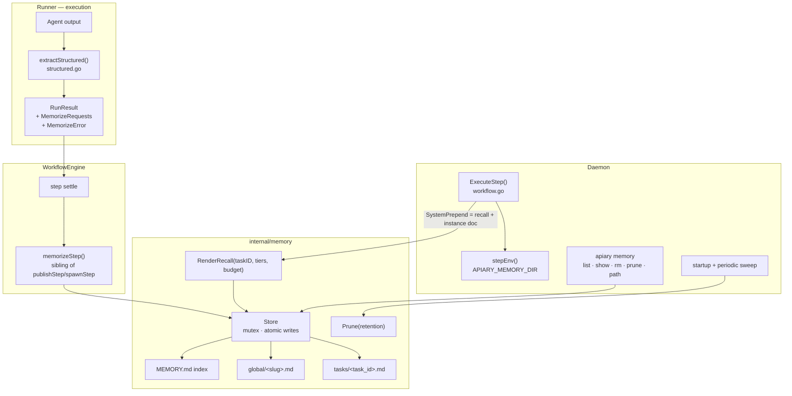

# Design: Agent Memory

## Architecture Overview

A new `internal/memory` package owns the on-disk store. The runner's structured-output parser gains one more marker; the engine gains one more settle-time handler (sibling of `publishStep` / `spawnStep`); the daemon injects rendered recall sections into the existing `SystemPrepend` channel and exposes the store path via env.



---

## Components and Integration Points

### 1. Marker parsing — `src/internal/runner/execution/structured.go`

Add to the existing constant block (`structured.go:14-22`):

```go
memorizeBegin = "APIARY_MEMORIZE_BEGIN"
memorizeEnd   = "APIARY_MEMORIZE_END"
```

`extractStructured()` (`structured.go:31`) gains a fourth block extraction, identical in shape to the spawn block: content between markers parsed as one JSON object or an array of objects; marker lines stripped from the visible output. `applyStructured()` (`structured.go:176`) maps the payloads onto `RunResult`:

```go
// model
type MemorizeRequest struct {
    Scope       string `json:"scope"`       // "task" (default) | "global"
    Name        string `json:"name"`        // slug; required for global
    Description string `json:"description"` // required for global
    Content     string `json:"content"`     // required
}

// RunResult additions
MemorizeRequests []model.MemorizeRequest
MemorizeError    string // malformed JSON — step warning, never failure
```

Parsing happens unconditionally (markers must be stripped from output even when memory is disabled, so they never leak into `APIARY_PUBLISH`-adjacent text or source comments); persistence is gated later by config.

### 2. Store — new package `src/internal/memory`

```go
type Store struct {
    root string
    mu   sync.Mutex // single daemon process; serialize all writes
}

func Open(root string) (*Store, error)            // mkdir -p root, global/, tasks/

// Writes (called from engine settle)
func (s *Store) UpsertGlobal(e Entry) error        // write global/<name>.md, regen MEMORY.md
func (s *Store) AppendTaskNote(taskID string, n Note) error // skip if hash == last note hash

// Recall (called from daemon ExecuteStep)
func (s *Store) RenderRecall(taskIDs []string, tiers []string, budget int) (string, error)

// Lifecycle
func (s *Store) Prune(terminalBefore func(taskID string) (bool, time.Time)) (int, error)
func (s *Store) RebuildIndex() error               // regen MEMORY.md from global/*.md frontmatter

// Curation (CLI)
func (s *Store) List() ([]EntryMeta, error)
func (s *Store) Read(name string) (Entry, error)
func (s *Store) Delete(name string) error
```

Implementation notes:

- **Atomic writes**: write to `<file>.tmp` in the same directory, then `os.Rename`. The index is always regenerated after a global write inside the same lock.
- **Slug validation**: `^[a-z0-9][a-z0-9-]{1,63}$`. Reject anything else (path-traversal guard — the name becomes a filename). `task_id` path components come from internal ULIDs, not agent input.
- **Entry size**: reject `Content` larger than `settings.memory.max_entry_bytes` (default 16 KiB) with a step warning.
- **Frontmatter**: minimal hand-rolled `key: value` block (name, description, created, updated, agent, task, workflow) — no new YAML dependency needed beyond what config already uses; reuse `gopkg.in/yaml.v3`.
- **Self-healing index**: `MEMORY.md` is derived state. Operators may delete or hand-edit entry files; `RebuildIndex` runs at daemon start and after every write.
- **Task note format**: one bullet per note — `- <RFC3339> [<workflow>/<step>] <content>` — multi-line content indented under the bullet.

### 3. Engine — `src/internal/workflow/engine.go`

A `memorizeStep()` handler runs in the same settle path as `spawnStep()` (engine.go:461) and `publishStep()` (engine.go:563), before publish so a step that both memorizes and publishes persists knowledge even if write-back fails:

1. No-op if memory disabled or `step.memory.memorize == "off"` (requests dropped, debug log).
2. For each request: validate scope/name/size → `UpsertGlobal` or `AppendTaskNote(task.ID, …)` with provenance from the step context.
3. `MemorizeError` or per-request validation failures append to step warnings (same surfacing as `SpawnError`); the step result state is untouched.

The engine needs access to the `*memory.Store`; it is constructed in the daemon and passed in like the task store (capability-style, matching how `TaskTracker` was wired).

### 4. Recall injection — `src/internal/daemon/workflow.go`

`ExecuteStep()` (workflow.go:345) currently sets `SystemPrepend: req.MemoryDoc` (workflow.go:362). Change:

```go
prepend := req.MemoryDoc
if memEnabled && step.Memory.ReadEnabled() {
    recall, _ := store.RenderRecall(lineage(req.TaskID), step.Memory.RecallTiers(), cfg.MaxInjectChars)
    prepend = recall + "\n" + prepend
}
```

- `lineage()` resolves the task's ancestor chain via the existing `GetTaskAncestors` store method (added in internal-task-model Phase 9), self first, root last.
- `RenderRecall` emits `[Long-term Memory]` (protocol line + index, truncated with an explicit `(… N more entries — read MEMORY.md)` marker) and `[Task Memory]` (own notes first, then ancestors', oldest dropped first under budget). Either section is omitted when its tier is excluded or empty.
- Render failures degrade to the instance doc alone (log warning, never block dispatch).

`buildPrompt()` (`runner/execution/cli.go:525`) is untouched — recall rides the existing `SystemPrepend` field.

### 5. Env — `src/internal/daemon/workflow.go:748`

`stepEnv()` identity base gains `APIARY_MEMORY_DIR=<memory root>` when memory is enabled. Explicit agent/workflow/step `env` can still override it (existing precedence: STEP > WORKFLOW > AGENT > base). Runners execute on the same host as the daemon, so the path is directly readable; if remote runners land later, recall injection still works (it's in-prompt) and only direct file reads degrade.

### 6. Config — `src/internal/config/config.go`

```go
type MemorySettings struct {
    Enabled        bool   `yaml:"enabled"`
    Path           string `yaml:"path"`             // default <data-dir>/memory
    MaxInjectChars int    `yaml:"max_inject_chars"` // default 4000
    MaxEntryBytes  int    `yaml:"max_entry_bytes"`  // default 16384
    TaskRetention  string `yaml:"task_retention"`   // duration, default "720h"
}
// Settings gains: Memory MemorySettings `yaml:"memory"`
```

Step-level (`src/internal/config/workflow.go:263`):

```go
type MemoryConfig struct {
    Read     *bool    `yaml:"read"`     // existing
    Write    []string `yaml:"write"`    // existing
    Recall   []string `yaml:"recall"`   // new: subset of {task, global}; default both
    Memorize string   `yaml:"memorize"` // new: "auto" (default) | "off"
}
```

Lint (`src/internal/config/lint.go`): strict decode already rejects unknown fields; add value checks (recall enum, memorize enum, retention parses as duration, max_* positive). Mirror the struct changes into `schema/apiary.json` and the `.apiary/example-*.yaml` files (per the PR #149 convention).

### 7. Pruning sweep — daemon

At `Start()` (next to `ReconcileOrphanWorkflowInstances`) and then every 6 h: for each `tasks/<id>.md`, look the task up; delete the file when the task is terminal and `updated_at + task_retention < now`, **unless** any descendant task is non-terminal (children inherit ancestor notes, so the chain stays readable while work is in flight). Unknown task IDs (DB reset) are deleted after the same retention based on file mtime.

### 8. CLI — `apiary memory`

| Command | Behavior |
|---|---|
| `apiary memory path` | Print the memory root |
| `apiary memory list` | Index view: name, description, updated, provenance agent |
| `apiary memory show <name>` | Print the entry (frontmatter + body) |
| `apiary memory rm <name>` | Delete entry + regen index |
| `apiary memory prune [--dry-run]` | Run the task-notes sweep on demand |

The CLI opens the store read/write directly (same process model as other `apiary` commands against the data dir); `RebuildIndex` on open makes concurrent daemon writes safe to interleave at the file level since all writes are atomic renames. Cross-process write races are accepted as benign for v1 (worst case: index one write stale, healed on next write).

---

## Security Notes

- **Recalled memory is untrusted model output.** It is injected as inert context inside clearly-delimited sections; the engine never parses markers out of recalled content (markers are only extracted from live step output). A memory entry containing `APIARY_SPAWN_BEGIN…` therefore cannot trigger spawns by being recalled.
- **Path safety.** Global entry filenames derive solely from the validated slug; task filenames from internal ULIDs. No agent-controlled string is joined into a path without validation.
- **Cross-project leakage is accepted by design** (global scope was chosen deliberately): any agent can read any global entry. Operators handling multi-tenant setups should treat the memory root as shared context — per-agent/per-project partitioning is a future change (provenance frontmatter already records enough to partition later).
- **Secrets.** Soul files / docs should instruct agents not to memorize credentials. v1 adds a best-effort lint: warn (don't block) when content matches common token patterns (`ghp_`, `xoxb-`, `AKIA…`).

## Edge Cases

| Case | Behavior |
|---|---|
| Memory disabled, agent emits marker | Marker stripped from output, request dropped silently |
| Malformed JSON in block | `MemorizeError` → step warning; step state unaffected |
| `global` without `name`/`description` | Request rejected with step warning |
| Duplicate task note (retry re-emits) | Content hash equals last note → skipped |
| Two steps memorize same global name concurrently | Store mutex serializes; last write wins; both recorded in `updated` |
| Index/entry drift (hand edits) | `RebuildIndex` at daemon start and on every write |
| Budget exceeded | Task notes drop oldest-first; index truncates with explicit count marker |
| Task with no notes / empty store | Sections omitted entirely — zero prompt overhead |

## Alternatives Considered

- **SQLite storage** — queryable and transactional, but the chosen requirement is human-readable, hand-editable files; the index file recovers the "queryable summary" property. Provenance frontmatter keeps a later DB migration mechanical.
- **Mounted memory directory as the write path** — agents editing files directly would bypass validation, size caps, and provenance stamping, and `WorkingDir` handling differs per runner. The marker keeps writes runner-agnostic and engine-mediated; reads remain direct (env var) since they are side-effect-free.
- **Per-agent scoping in v1** — rejected for now (decision: global store). Provenance fields make partitioning an additive follow-up.
- **Embedding/semantic recall** — out of scope; index-line recall plus agent-driven file reads is the v1 retrieval model.
