# Design: Internal Task Model

## Architecture Overview

The new layered model introduces InternalTask as the central unit. Sources are binders on the left edge; write-back targets on the right. Workflows can spawn new InternalTasks internally, creating a lineage tree independent of source systems.

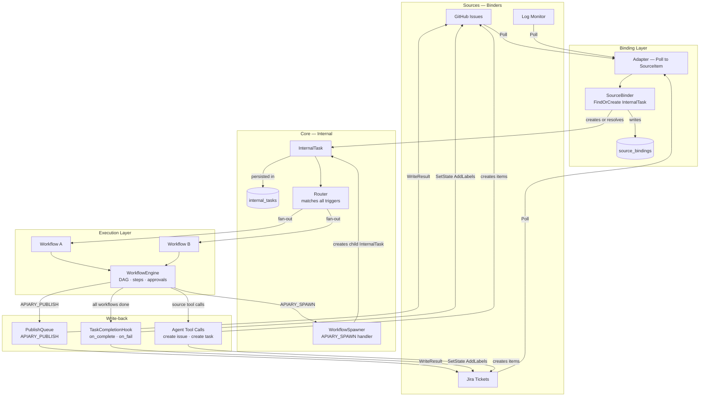

---

## Task Creation Paths

There are two ways an InternalTask is created. Both enter the same Router → WorkflowEngine pipeline.

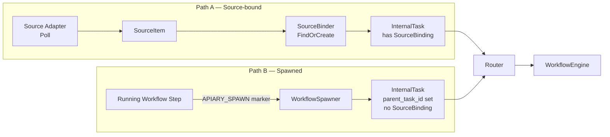

---

## Binding Flow

How a source item becomes an InternalTask (Path A).

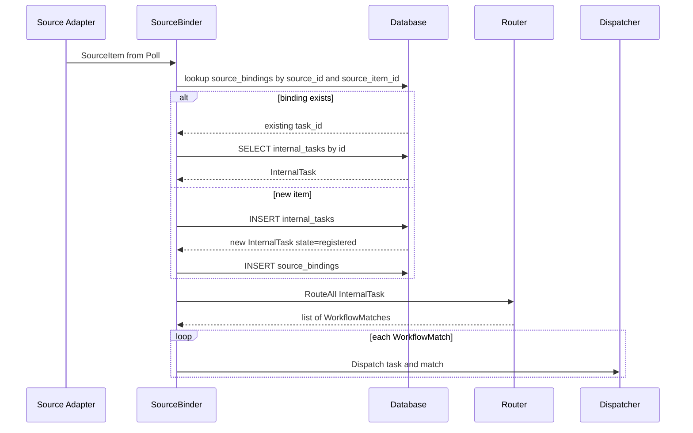

---

## Spawn Flow

How a workflow step creates a child InternalTask (Path B).

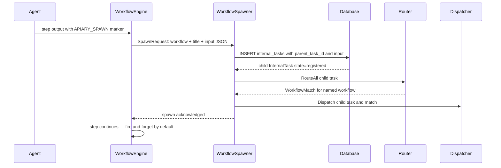

---

## Fan-out Dispatch

One InternalTask triggers N workflows. Each runs independently; the task tracks how many are outstanding.

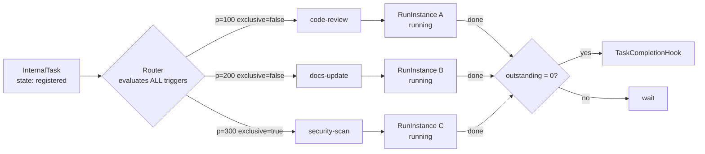

**Exclusive flag semantics:**

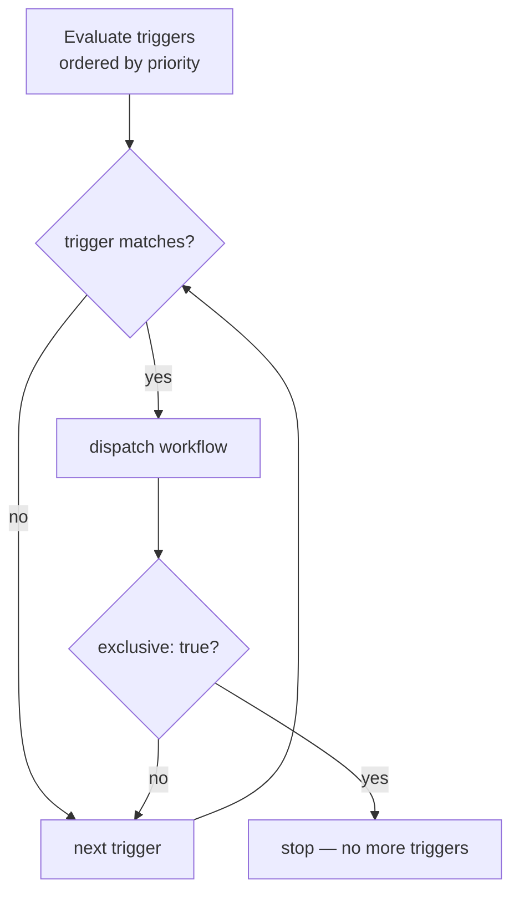

---

## Per-Step Write-back

Write-back is agent-driven. The agent emits an `APIARY_PUBLISH` block; the engine fans it out to every SourceBinding. If the task has no bindings the marker is silently ignored.

```mermaid
sequenceDiagram
    participant Agent
    participant Engine as WorkflowEngine
    participant PQ as PublishQueue
    participant DB
    participant Src as Source Adapters

    Agent->>Engine: step output
    Engine->>Engine: parse APIARY_PUBLISH marker
    alt marker found
        Engine->>DB: SELECT source_bindings by task_id
        DB-->>Engine: list of SourceBindings
        alt bindings exist
            loop each binding
                Engine->>PQ: enqueue binding and payload
            end
            PQ->>Src: WriteResult with payload
        else no bindings
            Engine->>Engine: silently ignore
        end
    else no marker
        Engine->>Engine: no write-back
    end
```

**Step config — publish control:**

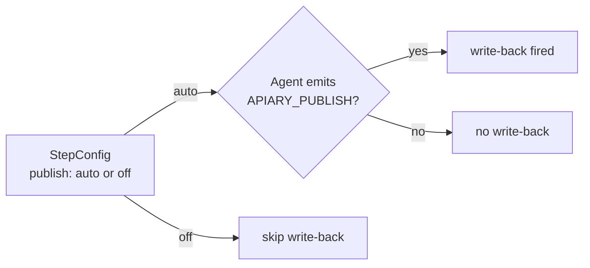

---

## Source-mediated Fan-out vs Internal Spawn

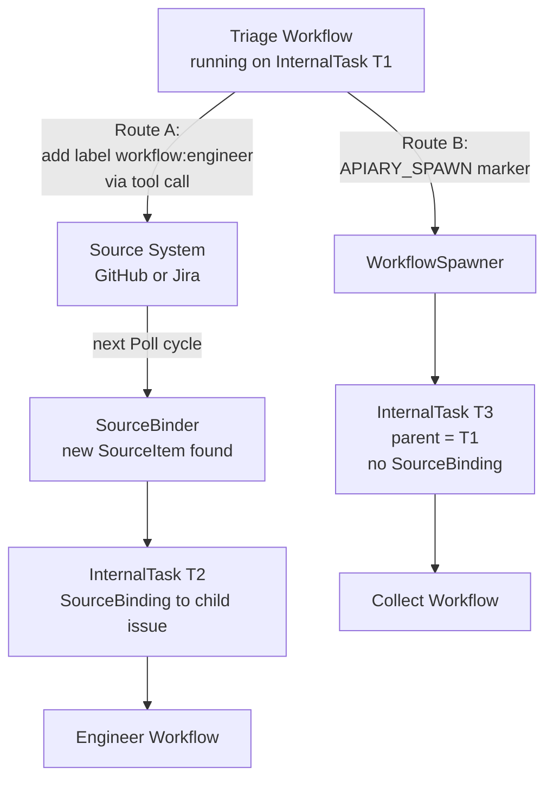

**When to use each:**

| | Source-mediated | APIARY_SPAWN |
|---|---|---|
| Downstream work needs a ticket | yes | no |
| No source system at the top | no | yes |
| Incident or log-driven chains | no | yes |
| Staff creating Jira stories | yes | no |
| Collect workflow before Staff | no | yes |

---

## Task Lineage

The Incident → Collect → Staff → Fix chain as a lineage tree.

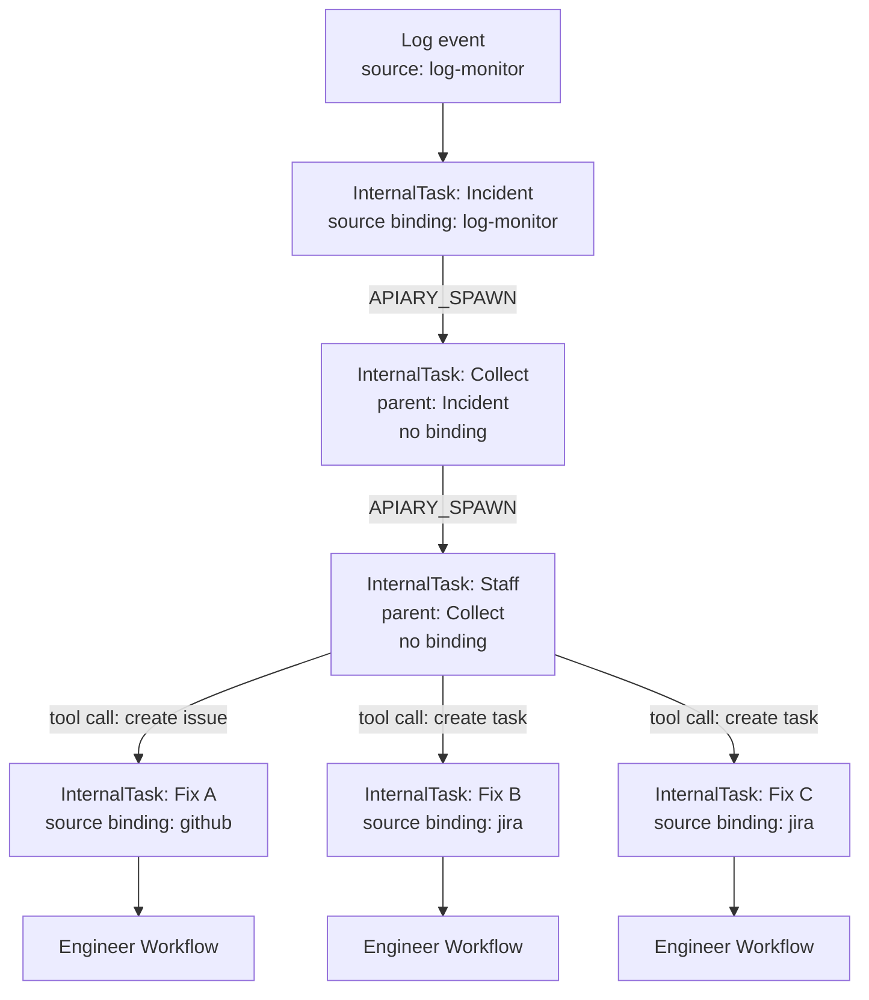

---

## InternalTask State Machine

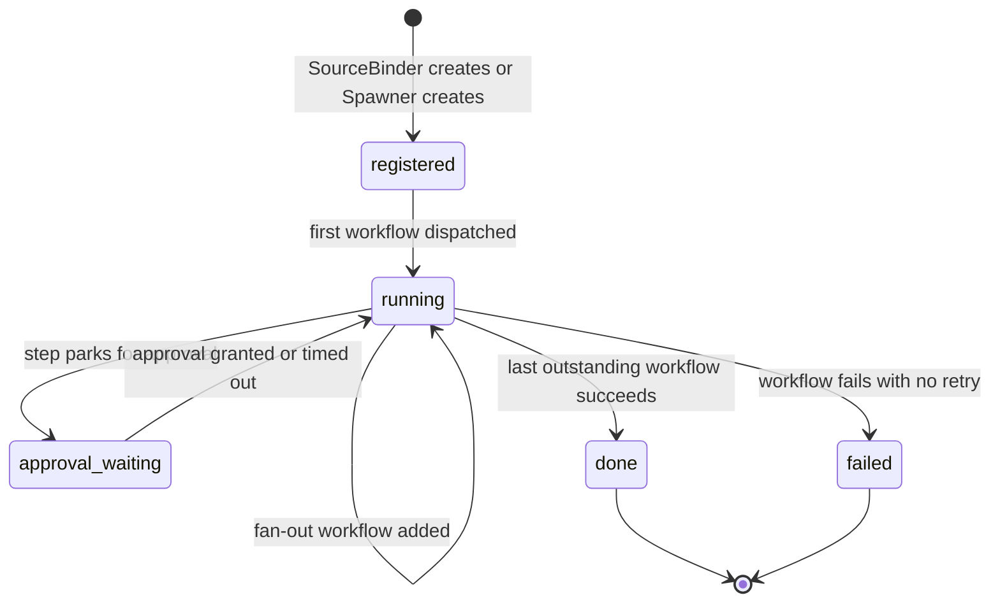

---

## Data Model

### New Tables

```sql
-- Canonical internal task registry
CREATE TABLE internal_tasks (
    id                    TEXT PRIMARY KEY,     -- ulid
    parent_task_id        TEXT REFERENCES internal_tasks(id),  -- set for spawned tasks
    title                 TEXT NOT NULL,
    description           TEXT,
    input                 TEXT,                 -- JSON: structured input from spawner
    state                 TEXT NOT NULL DEFAULT 'registered',
    -- 'registered' | 'running' | 'approval_waiting' | 'done' | 'failed'
    metadata              TEXT,                 -- JSON: labels, priority, type, etc.
    outstanding_workflows INTEGER DEFAULT 0,
    created_at            TIMESTAMP NOT NULL DEFAULT CURRENT_TIMESTAMP,
    updated_at            TIMESTAMP NOT NULL DEFAULT CURRENT_TIMESTAMP
);

-- Links source items to InternalTasks (one-to-many, optional)
CREATE TABLE source_bindings (
    id                 TEXT PRIMARY KEY,        -- ulid
    task_id            TEXT NOT NULL REFERENCES internal_tasks(id),
    source_id          TEXT NOT NULL,           -- e.g. "github", "jira"
    source_item_id     TEXT NOT NULL,           -- source-native item ID
    source_item_url    TEXT,                    -- deep-link for display
    source_item_number TEXT,                    -- human ref: "#42", "ERP-42"
    created_at         TIMESTAMP NOT NULL DEFAULT CURRENT_TIMESTAMP,
    UNIQUE(source_id, source_item_id)
);
```

### Modified Tables

```sql
-- workflow_instances: replace source_item_id+source_id with task_id
ALTER TABLE workflow_instances
    ADD COLUMN task_id TEXT REFERENCES internal_tasks(id);
-- source_item_id and source_id retained for backward compat during migration, then dropped

-- step_runs: add publish and spawn tracking
ALTER TABLE step_runs
    ADD COLUMN publish_payload TEXT,            -- extracted APIARY_PUBLISH content, if any
    ADD COLUMN publish_state   TEXT,            -- null | 'queued' | 'sent' | 'failed'
    ADD COLUMN spawned_task_id TEXT REFERENCES internal_tasks(id);  -- if step emitted APIARY_SPAWN
```

### Dropped (after migration)

```sql
-- workflow_instances.source_item_id  → replaced by task_id
-- workflow_instances.source_id       → resolved via source_bindings
```

---

## Go Types

```go
// internal/model/task.go

type TaskState string

const (
    TaskStateRegistered   TaskState = "registered"
    TaskStateRunning      TaskState = "running"
    TaskStateApprovalWait TaskState = "approval_waiting"
    TaskStateDone         TaskState = "done"
    TaskStateFailed       TaskState = "failed"
)

type InternalTask struct {
    ID                   string
    ParentTaskID         string            // empty if root task
    Title                string
    Description          string
    Input                map[string]any    // structured input from spawner, nil for source-bound tasks
    State                TaskState
    Metadata             TaskMetadata
    OutstandingWorkflows int
    CreatedAt            time.Time
    UpdatedAt            time.Time
}

type TaskMetadata struct {
    Labels   []string
    Priority string
    Type     string     // "issue", "work_item", "log_event", "internal", ...
}

type SourceBinding struct {
    ID               string
    TaskID           string
    SourceID         string
    SourceItemID     string
    SourceItemURL    string
    SourceItemNumber string
    CreatedAt        time.Time
}
```

```go
// internal/source/binder.go

type SourceBinder interface {
    // Bind normalizes a SourceItem into an InternalTask, creates a SourceBinding
    // if one does not exist yet, and returns the task (new or existing).
    Bind(ctx context.Context, item model.SourceItem) (model.InternalTask, error)
}
```

```go
// internal/workflow/spawner.go

type SpawnRequest struct {
    ParentTaskID string
    WorkflowID   string
    Title        string
    Input        map[string]any
}

type WorkflowSpawner interface {
    Spawn(ctx context.Context, req SpawnRequest) (model.InternalTask, error)
}
```

```go
// internal/config/config.go — additions

type TriggerConfig struct {
    Priority  int        `yaml:"priority"`
    Exclusive bool       `yaml:"exclusive"` // stops evaluating further triggers
    Match     RouteMatch `yaml:"match"`
}

type StepConfig struct {
    // ... existing fields ...
    Publish string `yaml:"publish"` // "auto" (default) | "off"
    Spawn   string `yaml:"spawn"`   // "auto" (default, fire-and-forget) | "await"
}

type TasksConfig struct {              // top-level tasks: block
    OnComplete *OnComplete `yaml:"on_complete"`
    OnFail     *OnComplete `yaml:"on_fail"`
}
```

---

## Affected Components

| Component | Change |
|---|---|
| `internal/source/binder.go` | **New.** SourceBinder; replaces inline SourceItem→dispatch in daemon |
| `internal/workflow/spawner.go` | **New.** WorkflowSpawner; handles APIARY_SPAWN, creates child InternalTasks |
| `internal/model/task.go` | **New.** InternalTask, SourceBinding, TaskMetadata types |
| `internal/model/source_item.go` | **Renamed from cell.go.** SourceItem stays within binding layer only |
| `internal/router/router.go` | **Changed.** `Route(SourceItem)` → `RouteAll(InternalTask) []Match` |
| `internal/daemon/dispatcher.go` | **Changed.** Calls binder, passes task to RouteAll, fans out dispatches |
| `internal/workflow/engine.go` | **Changed.** Accepts InternalTask; parses APIARY_SPAWN and APIARY_PUBLISH markers; resolves bindings for write-back |
| `internal/daemon/workflow.go` | **Changed.** SideEffects resolves adapter via SourceBinding, not SourceItem.SourceID |
| `internal/db/schema.go` | **Changed.** New tables; migration for workflow_instances |
| `internal/config/config.go` | **Changed.** TriggerConfig.Exclusive, StepConfig.Publish, StepConfig.Spawn, new TasksConfig |
| `apps/dashboard` | **Changed.** Task view shows lineage tree, SourceBindings, and WorkflowInstances per task |

---

## Open Questions

1. **Multi-source binding**: today a task has one binding (one source item). The schema supports many. Should the binder ever merge two source items into one InternalTask? Deferred.

2. **Await semantics for spawn**: when `spawn: await`, the spawning step blocks until the child task reaches a terminal state. If the child fails, does the parent step fail too? Proposed default: yes (propagate failure). Deferred to implementation.

3. **Per-binding publish**: currently `APIARY_PUBLISH` fans out to all bindings equally. A future `APIARY_PUBLISH[github]` syntax could target a specific source. Deferred.

4. **Tool-created source items and lineage**: when an agent creates a GitHub issue via tool call, there is no automatic link back to the parent task. The spawned InternalTask only gets its SourceBinding when the new issue is polled and bound. A future `APIARY_BIND` marker or tool return hook could accelerate this. Deferred.
