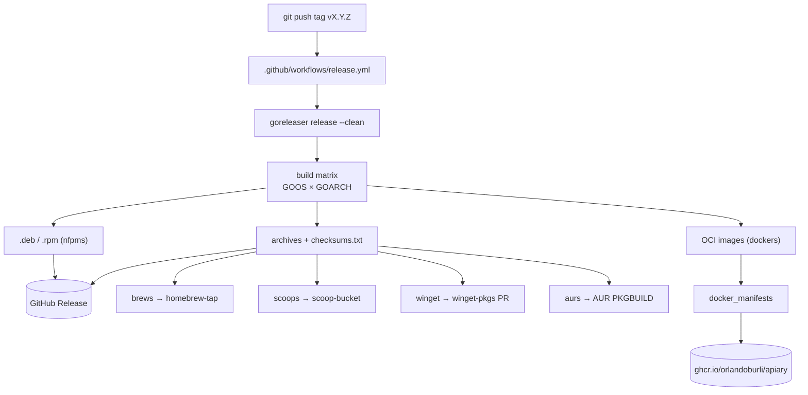

# Design: Binary Distribution

## Overview

A single `.goreleaser.yaml` at the repo root is the source of truth for every artifact. A GitHub Actions workflow runs GoReleaser on each `v*` tag push. GoReleaser cross-compiles the binary, packages it per channel, and publishes to the GitHub Release plus the external channel repos. No application code changes.



---

## Build Matrix

| GOOS | GOARCH | Notes |
|---|---|---|
| darwin | amd64 | Intel Macs |
| darwin | arm64 | Apple Silicon |
| linux | amd64 | also feeds the amd64 Docker image |
| linux | arm64 | also feeds the arm64 Docker image |
| windows | amd64 | `.zip` archive, `.exe` binary |
| windows | arm64 | best-effort; drop if it complicates the matrix |

### cgo cross-compilation (the hard part)

Because `mattn/go-sqlite3` needs cgo, a single Ubuntu runner **cannot** `GOOS`-cross-compile to all targets — each target needs its own C toolchain. Three viable strategies, pick one in implementation:

| Strategy | How | Trade-off |
|---|---|---|
| **A. `goreleaser-cross` image** (recommended) | run GoReleaser inside `ghcr.io/goreleaser/goreleaser-cross`, which bundles macOS (osxcross), Windows (mingw), and Linux cross toolchains | one Linux runner builds everything; large image, macOS SDK licensing caveat |
| **B. matrix of native runners** | `macos-latest` (darwin), `windows-latest` (windows), `ubuntu-latest` (linux) each run `goreleaser build --single-target`, then a final job assembles the release | clean toolchains, no osxcross; more workflow plumbing, must stitch artifacts |
| **C. `zig cc` as the C compiler** | set `CC=zig cc -target ...` per goarch | lightweight, no Docker; zig+cgo+sqlite has sharp edges, needs care |

Strategy **A** is the lowest-friction for a first cut; **B** is the most robust long-term. The `.goreleaser.yaml` build block differs per strategy (per-target `env: [CC=...]`), so this decision gates the build config.

- **`CGO_ENABLED=1` is REQUIRED.** Apiary depends on `github.com/mattn/go-sqlite3`, a **cgo** driver. A pure-Go static build is *not* available without swapping the driver. This is the dominant constraint on the whole pipeline — see "cgo cross-compilation" below and Open Question #1.
- `flags: -trimpath` for reproducible paths.
- `ldflags` MUST set the **same** variable the Makefile uses:
  `-s -w -X github.com/orlandoburli/apiary/internal/version.Version={{.Version}}`
  so released binaries report the tag via `apiary version` / `--version`.

---

## `.goreleaser.yaml` shape (illustrative, not final)

```yaml
version: 2

project_name: apiary

builds:
  - id: apiary
    main: ./cmd/apiary
    dir: src                      # module's go code lives under src/
    binary: apiary
    env: [CGO_ENABLED=1]          # mattn/go-sqlite3 needs cgo — see "cgo cross-compilation"
    goos: [darwin, linux, windows]
    goarch: [amd64, arm64]
    flags: [-trimpath]
    ldflags:
      - -s -w
      - -X github.com/orlandoburli/apiary/internal/version.Version={{.Version}}

archives:
  - formats: [tar.gz]
    format_overrides:
      - goos: windows
        formats: [zip]
    name_template: "{{ .ProjectName }}_{{ .Version }}_{{ .Os }}_{{ .Arch }}"

checksum:
  name_template: "checksums.txt"

nfpms:
  - maintainer: Orlando Burli <orlando.developermaster@gmail.com>
    description: Agent orchestration via GitHub Issues, Plane, and other sources.
    license: see LICENSE
    formats: [deb, rpm]
    bindir: /usr/bin

brews:
  - repository: { owner: orlandoburli, name: homebrew-tap }
    homepage: "https://github.com/orlandoburli/apiary"
    description: "Agent orchestration CLI"

scoops:
  - repository: { owner: orlandoburli, name: scoop-bucket }
    homepage: "https://github.com/orlandoburli/apiary"

winget:
  - publisher: orlandoburli
    repository: { owner: orlandoburli, name: winget-pkgs, branch: apiary }
    # opens a PR against microsoft/winget-pkgs via the fork

aurs:
  - name: apiary-bin
    homepage: "https://github.com/orlandoburli/apiary"
    git_url: "ssh://aur@aur.archlinux.org/apiary-bin.git"

dockers:
  - image_templates: ["ghcr.io/orlandoburli/apiary:{{ .Version }}-amd64"]
    use: buildx
    build_flag_templates: ["--platform=linux/amd64"]
  - image_templates: ["ghcr.io/orlandoburli/apiary:{{ .Version }}-arm64"]
    use: buildx
    build_flag_templates: ["--platform=linux/arm64"]
    goarch: arm64

docker_manifests:
  - name_template: "ghcr.io/orlandoburli/apiary:{{ .Version }}"
    image_templates:
      - "ghcr.io/orlandoburli/apiary:{{ .Version }}-amd64"
      - "ghcr.io/orlandoburli/apiary:{{ .Version }}-arm64"
  - name_template: "ghcr.io/orlandoburli/apiary:latest"
    image_templates:
      - "ghcr.io/orlandoburli/apiary:{{ .Version }}-amd64"
      - "ghcr.io/orlandoburli/apiary:{{ .Version }}-arm64"

release:
  github: { owner: orlandoburli, name: apiary }
```

> The `dir: src` + `main: ./cmd/apiary` pairing mirrors the Makefile (`cd $(SRC) && go build ... ./cmd/apiary`). Confirm GoReleaser resolves the module correctly with this layout during the first dry run.

---

## Release Workflow

`.github/workflows/release.yml`:

```yaml
name: release
on:
  push:
    tags: ["v*"]
permissions:
  contents: write        # create the GitHub Release
  packages: write        # push to ghcr.io
jobs:
  goreleaser:
    runs-on: ubuntu-latest
    steps:
      - uses: actions/checkout@v4
        with: { fetch-depth: 0 }      # full history for git describe / changelog
      - uses: actions/setup-go@v5
        with: { go-version-file: go.mod }
      - uses: docker/login-action@v3
        with: { registry: ghcr.io, username: ${{ github.actor }}, password: ${{ secrets.GITHUB_TOKEN }} }
      - uses: goreleaser/goreleaser-action@v6
        with: { version: "~> v2", args: release --clean }
        env:
          GITHUB_TOKEN: ${{ secrets.GITHUB_TOKEN }}
          TAP_GITHUB_TOKEN: ${{ secrets.TAP_GITHUB_TOKEN }}   # cross-repo push to taps
          AUR_KEY: ${{ secrets.AUR_KEY }}                     # AUR SSH deploy key
```

### Required secrets

| Secret | Why | Notes |
|---|---|---|
| `GITHUB_TOKEN` | GitHub Release + ghcr.io push | provided by Actions automatically |
| `TAP_GITHUB_TOKEN` | push formula/manifest to `homebrew-tap`, `scoop-bucket`, and the `winget-pkgs` fork | a fine-grained PAT with `contents:write` on those repos — the default `GITHUB_TOKEN` cannot push to *other* repos |
| `AUR_KEY` | SSH key registered with the AUR account | only if AUR is in the first release; otherwise defer |

---

## Prerequisite repos (one-time setup)

| Repo | Purpose | Create before first release |
|---|---|---|
| `orlandoburli/homebrew-tap` | Homebrew formula target | yes |
| `orlandoburli/scoop-bucket` | Scoop manifest target | yes |
| `orlandoburli/winget-pkgs` (fork) | base for winget PRs | yes (if winget in v1) |
| AUR `apiary-bin` | Arch package | only if AUR in v1 |

ghcr.io needs no repo — the package is created on first push (set visibility to public afterward).

---

## Validation strategy

1. **`goreleaser check`** in CI on PRs touching `.goreleaser.yaml` — config lint, no publish.
2. **`goreleaser release --snapshot --clean`** on a manual dispatch or PR — builds *all* artifacts locally without publishing. This is the real confidence gate before tagging.
3. **First real tag** = a pre-release (`v0.x.0`) so any channel misconfiguration is low-stakes.
4. Smoke: download each artifact, run `apiary version`, confirm it prints the tag.

---

## Documentation impact

- Rewrite the README install section: per-platform install commands (brew/scoop/winget/apt/docker/`go install`) replacing the clone-and-build instructions, which move to `DEVELOPMENT.md`.
- Add an **Install** page to the mkdocs site (`docs/`) mirroring the README.
- Document the unsigned-binary Gatekeeper/SmartScreen workaround prominently until notarization/signing lands.

---

## Open Questions

1. **SQLite driver** — *Resolved & done.* Migrated `mattn/go-sqlite3` → pure-Go `modernc.org/sqlite`, so `CGO_ENABLED=0` and all 6 targets cross-compile on a single Ubuntu runner — no osxcross/mingw/zig. The cgo strategy section above is retained for historical context but is no longer needed. **Note:** the root `go.mod` is vestigial (no `.go` files live outside `src/`); it still lists `mattn/go-sqlite3` and should be reconciled — see Open Question #5.
2. **winget in v1 or v2?** It adds the most moving parts (fork, PR automation, Microsoft review latency). Reasonable to ship brew+scoop+releases+docker first and add winget in a fast follow.
3. **AUR in v1 or v2?** Needs an AUR account + SSH deploy key. Low cost but external; can defer.
4. **`latest` Docker tag policy** — *Resolved:* **stable-only.** The `:latest` manifest sets `skip_push: auto`, so prereleases/snapshots never move `:latest`.
6. **`dockers_v2` migration** — GoReleaser deprecated `dockers` + `docker_manifests` in favor of `dockers_v2` (still functional in v2.x, "eventually" removed). The current config uses the classic blocks (well-documented, validated end-to-end). Migrate to `dockers_v2` in a later cleanup before removal.
5. **Vestigial root `go.mod` + the `go install` channel.** The repo has two modules with the *same* path `github.com/orlandoburli/apiary`: one at root (governs no code — there are no `.go` files outside `src/`) and the real one at `src/`. Because the module lives in `src/` but its path doesn't end in `/src`, **`go install github.com/orlandoburli/apiary/cmd/apiary@latest` will not resolve** — the proposal's "`go install` works" claim is currently false. Options: (a) delete the root `go.mod`/`go.sum` and document that `go install` needs the in-tree path / isn't supported; (b) restructure so the module is at the repo root (move `src/*` up, or change the layout) to make `go install` work. This is a pre-existing structural issue, surfaced by this change but arguably its own cleanup. **Needs a decision before the docs are written (Phase 6).**
