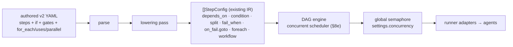
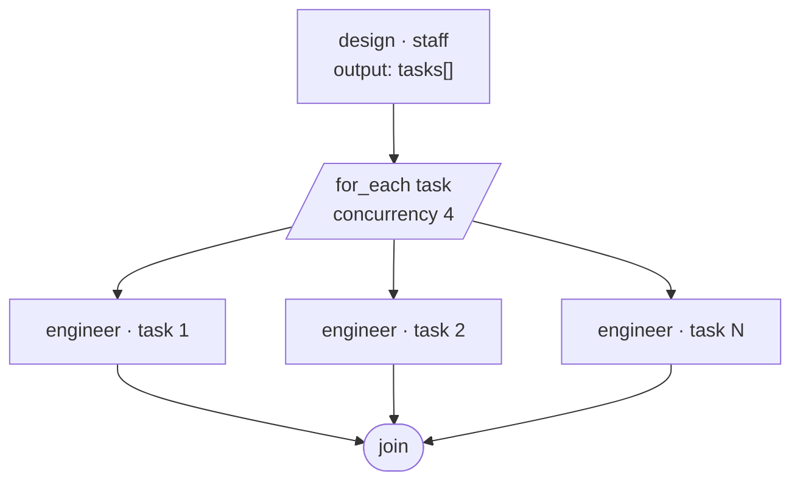
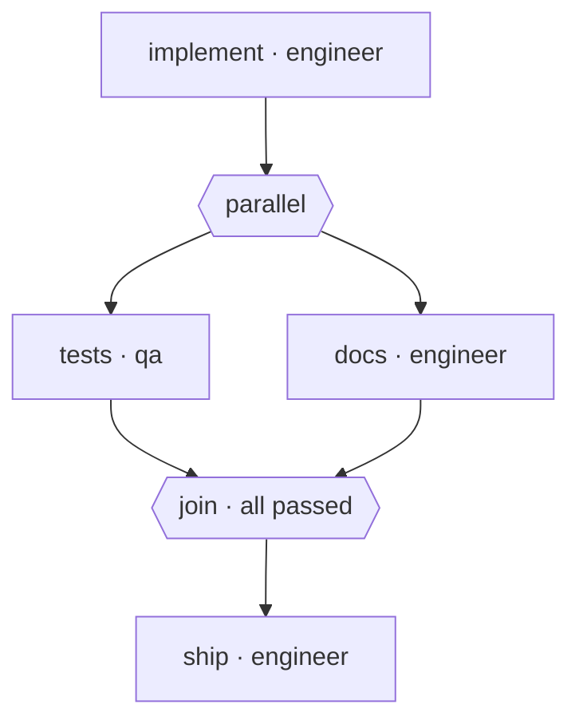
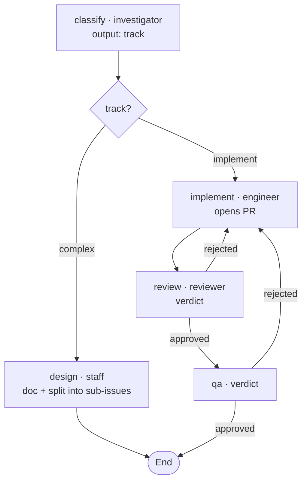

# Design — Workflow authoring v2 (GitHub Actions–inspired)

> Design only. Describes the authoring surface, how it lowers to the current DAG
> engine, and the small engine capabilities it needs.

## 0. Inspiration: GitHub Actions

The authored surface follows the GitHub Actions `steps:` model, which already
matches the requested feel: a flat, ordered list that runs top-to-bottom, each
step optionally guarded by `if:`, with outputs referenced across steps.

| GitHub Actions            | Apiary v2                              |
|---------------------------|---------------------------------------|
| `steps:` (ordered)        | `steps:` (ordered, implicit sequence) |
| `uses:` / `run:`          | `agent:`                              |
| `with:`                   | `prompt:` (per-step instruction)      |
| `id:`, `name:`            | `id:`, `name:`                        |
| `if: ${{ … }}`            | `if: ${{ … }}` (skip when false)      |
| step outputs (`$GITHUB_OUTPUT`) | `output:` schema, filled from `APIARY_OUTPUT` |
| `${{ steps.x.outputs.y }}`| `${{ steps.x.outputs.y }}` (short: `x.y`) |
| `github`, `env` contexts  | `cell`, `workflow` contexts           |
| `continue-on-error`       | `reject_when` + `on_reject` (richer: loop-back) |

Where Actions stops (it has no "reject → redo an earlier step"), we add the gate
primitives in §2.

## 1. Authoring model

`steps:` is a flat **ordered list**. Each step:

```yaml
- id: review                 # optional; required only if referenced
  name: Review the PR        # optional, human label
  agent: reviewer
  prompt: "..."              # optional per-step instruction
  if: ${{ steps.classify.outputs.track == 'implement' }}   # optional guard
  output:                    # structured-output schema; fields become outputs
    verdict: { enum: [approved, rejected] }
  reject_when: ${{ steps.review.outputs.verdict == 'rejected' }}
  on_reject: { restart_from: implement, max: 3 }
```

Rules:
- **Implicit sequencing.** Step *N* runs after step *N-1*. Declaration order =
  execution order. No `depends_on` in the authored form.
- **Per-step `if:`** (GHA-style). Evaluated before the step runs; false → the step
  is **skipped** and the sequence continues. Branching is expressed by giving steps
  complementary conditions (the "implement" steps carry
  `if: …track == 'implement'`; the "complex" step carries `if: …track ==
  'complex'`). No `then/else` blocks, no `goto`, and **no explicit join** — a step
  after a branch simply omits `if:` and runs next.
- **Outputs & references.** Declaring `output:` makes a step's fields addressable
  as `${{ steps.<id>.outputs.<field> }}`, with `<id>.<field>` as a short alias.
  No manual `memory.write`.
- **Expressions** use `${{ … }}` over contexts `steps`, `cell`, `workflow`.
- A step with an unmet `if:` and everything depending on its output skips too
  (handled by the engine skip-cascade).

## 2. Approval / reject gates (beyond Actions)

```yaml
- id: review
  agent: reviewer
  output: { verdict: { enum: [approved, rejected] } }
  reject_when: ${{ steps.review.outputs.verdict == 'rejected' }}
  on_reject: { restart_from: implement, max: 3 }
```

- After the agent runs, evaluate `reject_when` against the step's **own** fresh
  output → true means **rejected** (a logical failure, distinct from a crash).
- `on_reject.restart_from: <earlier step id>` re-runs from that step (and
  everything after), up to `max` times.
- No `on_reject` + rejected, or retries exhausted → the workflow fails →
  `on_fail` (e.g. `add_labels: [needs-attention]`) — escalate to a human.
- A real crash (agent exits non-zero) is still a failure independent of
  `reject_when`.

## 3. Engine capabilities needed

Everything else is authoring-time lowering. The engine needs three additions; the
first two are small and localized, the third (concurrency) is the substantial one
and is now **in scope** (§8e).

1. **`fail_when`** on the agent step. Today `Success = (cli exit == 0)`
   (`runner/execution/cli.go:197`). In `workflow/dag.go` `runAgentDAGStep`, after
   `runStep` returns `res`, build a transient eval context = current memory +
   *this* step's fresh structured output, then
   `failed := !res.Success || eval(fail_when)`. Reuse `EvalContext` /
   `ParseExpr` / `Eval` (`workflow/expr.go`). Existing `on_fail.goto` +
   `max_retries` + `resetLoop` handle the loop-back unchanged.

2. **Step-level `condition`** (the lowered form of per-step `if:`). In
   `pickRunnable`/scheduling, a step whose `condition` evaluates false is marked
   **skipped** (cascading to dependents via existing `markSkipped`). This is the
   GHA `if:` semantics and is simpler than synthesizing a `split` per condition.

3. **Concurrent scheduler + global agent semaphore** (§8e) — runs all
   currently-runnable steps at once and bounds total simultaneous agent invocations
   by `settings.concurrency`. This is what makes `parallel:` and
   `for_each.concurrency` real.

## 4. Lowering v2 → current DAG `StepConfig`



The parser compiles the authored list into today's `[]StepConfig`:

| v2 (authored)                 | Lowered form |
|-------------------------------|--------------|
| order (implicit sequence)     | `depends_on: [<previous step id>]` |
| per-step `if: ${{ … }}`       | step-level `condition` (§3.2) |
| `${{ steps.x.outputs.y }}` / `x.y` | rewritten to the flat `memory.y` lookup; parser adds `y` to step *x*'s `memory.write` (field names unique per workflow; else qualify) |
| `output: {…}`                 | `output_schema: {…}` (alias) |
| `reject_when`                 | `fail_when` (§3.1) |
| `on_reject: {restart_from, max}` | `on_fail: {goto: restart_from, max_retries: max}` |

`split`/`goto` are **not** emitted by the lowering — branching is per-step
`condition`. (`split` remains a valid hand-authored low-level primitive; see §6.)
Because lowering targets existing structures, current engine tests keep passing and
v2 is verified by asserting the lowered DAG matches a golden `[]StepConfig`.

## 5. Reject feedback survives the loop (via the PR, not memory)

`resetLoop(target)` resets the target and its transitive dependents to pending and
**deletes their memory contributions**. So when `review` rejects and restarts from
`implement`, the reviewer's contribution is wiped — the engineer would not see the
feedback through workflow memory.

Resolution: rejection feedback lives on the **PR** (reviewer posts a real GitHub
review/comments; QA posts findings). On restart, the engineer re-reads the PR
thread. Workflow memory only carries the gate verdict. This matches how human teams
work and sidesteps the memory reset. Souls are written accordingly.

## 6. Backward compatibility

- `depends_on`, `split`/`branches`/`goto` remain valid — the low-level form the v2
  surface lowers to. Existing configs run unchanged.
- `depends_on` is **kept as an advanced escape hatch** for non-linear/diamond flows
  (decision r1); the default authored surface is sequence + per-step `if:`.
- v2 is additive. A flow may not mix authored `if:`/sequence with hand-written
  `goto` (validation rejects the ambiguous mix).
- Docs/examples move to v2; `split`/`depends_on` documented as low-level.

## 7. Decisions (review round 1) & remaining questions

Resolved:
1. **Branching = per-step `if:`** (GHA-style); no `then/else` blocks. This also
   resolves the earlier "join after a block" question — there are no blocks, so a
   post-branch step just omits `if:` (implicit any-passed continuation).
2. **`depends_on` kept as advanced** escape hatch.
3. **Step-scoped references** `${{ steps.<id>.outputs.<field> }}` (short `<id>.<field>`).
4. **`output:`** adopted as the authored key (alias of `output_schema:`).

Remaining (decide at implementation):
- Whether to support the `${{ … }}` delimiter literally or accept bare expressions
  (e.g. `if: "classify.track == 'complex'"`). Leaning: accept both; `${{ }}` for
  GHA familiarity, bare for brevity.
- Field-name collisions when two steps emit the same output field — qualify by step
  id in the lowered `memory` namespace if it ever happens.

## 8. Composition: loops, parallel, sub-workflows (GHA-inspired)

All three were in the original `workflow-mode` spec. Status and v2 surface:

### a) Loop over child items — `for_each` (GHA `strategy.matrix`)
**Engine: built, but serial.** `StepTypeForeach` exists (`workflow/foreach.go`); it
iterates `items` and binds each to `as`, but the loop is a plain `for range` — the
`concurrency` field is parsed and **ignored** today.

```yaml
- id: implement-tasks
  for_each: ${{ steps.design.outputs.tasks }}   # array from a prior step's output
  as: task
  agent: engineer
  prompt: "Implement: ${{ task.title }}"
  max: 20            # cap (lowers to foreach max_items)
  concurrency: 4     # run N items at once  ← needs engine to honor it
```
Lowers to the existing `type: foreach` (`items`/`as`/`max_items`/`step`). Use case:
Staff emits a `tasks` array → fan out an engineer run per task. **Work to do:**
honor `concurrency` (bounded goroutines over items) — depends on §8e.



### b) Sub-workflows / sub-steps — `uses` (GHA reusable workflows)
**Engine: built.** `StepTypeWorkflow` (`workflow/subworkflow.go`) runs another named
workflow as a step (one level of nesting), inheriting memory.

```yaml
- id: ship
  uses: implement-pipeline        # call another workflow by id
  if: ${{ classify.track == 'implement' }}
```
This is how a track becomes a reusable building block: define `implement-pipeline`
(engineer→review→qa) once, `uses:` it from `triage` and elsewhere. Lowers to
`type: workflow, workflow: implement-pipeline`. v2 work is just the `uses:` alias +
parse.

### c) Parallel steps — `parallel:` block (GHA parallel jobs)
**Engine: in scope** (scheduler design in §8e). `driveDAG`/`pickRunnable` runs one
step at a time today; this change makes the executor run all ready steps
concurrently, bounded by the global semaphore.

```yaml
- parallel:                       # run these concurrently, join when all pass
    - { id: tests, agent: qa,       prompt: "Run the test suite." }
    - { id: docs,  agent: engineer, prompt: "Update the docs." }
# steps after the block run once BOTH finished (selective join)
```
Lowers to: block members share the upstream dep and have no order between them; the
next step `depends_on` all of them (selective join — proceed only when all pass).



### d) Concurrency model
Adopt the original `concurrency-model` decision: `settings.concurrency` is one
global cap on simultaneous agent invocations across all instances, parallel steps,
and foreach items. Every runner call acquires/releases one slot. This is what makes
`for_each.concurrency` and `parallel:` safe (no 24-agents-on-one-workdir blowups).
Per-agent `max_workers` remains as a secondary cap (acquire both).

### e) Concurrent scheduler design (the substantial piece)

Turn the sequential loop into a concurrent one:

- **`pickAllRunnable()`** replaces `pickRunnable()` — returns *every* step that is
  activated, pending, condition-true, and deps-passed.
- The driver launches each on a goroutine that acquires a **global semaphore**
  (`settings.concurrency`) and its per-agent slot before invoking the runner, and
  releases on completion. Results return on a channel.
- A single **scheduler goroutine owns `dagRun` state**; worker goroutines only run
  agents and send results back. The scheduler applies each result (set
  passed/failed, split activation, `on_fail.goto` reset), then re-computes the
  runnable set and dispatches newly-unblocked steps. No shared-state mutation off
  the scheduler goroutine → no lock sprawl. (`dagRun` stays single-writer.)
- **Termination:** done when nothing is running and nothing is runnable; then the
  existing failed/skip logic decides the outcome.

Concurrency-specific decisions:
- **Deterministic memory ordering.** `passedOrder` must order by **declaration
  order**, not completion order, so the memory document and last-write-wins are
  reproducible regardless of who finishes first.
- **Loop-back while siblings run.** If a step triggers `on_fail.goto`, the
  scheduler stops dispatching new work, lets in-flight siblings finish (or cancels
  them — decision below), applies `resetLoop`, then resumes. Default: **let
  in-flight finish, then reset** (simpler, no cancellation races).
- **Approval steps** force a quiesce: when an approval becomes runnable the
  scheduler drains in-flight steps, then parks (`outcomeWaiting`) as today.
- **`for_each.concurrency`** uses the same global semaphore for its item runs.

Risk/cost: this is the largest part. It is additive — when `settings.concurrency`
is 1, behaviour is identical to today's sequential executor, so existing tests and
flows are unchanged; concurrency is opt-in by raising the cap and using `parallel:`.

**Scope summary:** (b) ~free (alias); (a) easy (alias, real once §8e lands);
(c)+(d)+(e) are the real engineering, now included in this change.

## 9. Worked example — the two target flows (authored form)



The authored YAML (per-step `if:` + gates) that produces the flow above:


```yaml
workflows:
  - id: triage
    trigger:
      match: { source: project-erp, exclude_label_prefix: "agent:" }
    steps:
      - id: classify
        name: Classify the issue
        agent: investigator
        output: { track: { enum: [implement, complex] } }

      # Complex track → Staff documents + splits into sub-issues, then End.
      - id: design
        name: Design & decompose
        agent: staff
        if: ${{ classify.track == 'complex' }}

      # Implementation track → Engineer → Reviewer → QA, reject loops back.
      - id: implement
        name: Implement & open PR
        agent: engineer
        if: ${{ classify.track == 'implement' }}

      - id: review
        name: Review the PR
        agent: reviewer
        if: ${{ classify.track == 'implement' }}
        output: { verdict: { enum: [approved, rejected] } }
        reject_when: ${{ review.verdict == 'rejected' }}
        on_reject: { restart_from: implement, max: 3 }

      - id: qa
        name: QA validation
        agent: qa
        if: ${{ classify.track == 'implement' }}
        output: { verdict: { enum: [approved, rejected] } }
        reject_when: ${{ qa.verdict == 'rejected' }}
        on_reject: { restart_from: implement, max: 3 }

    on_complete: { set_state: closed }
    on_fail:     { add_labels: [needs-attention] }
```
