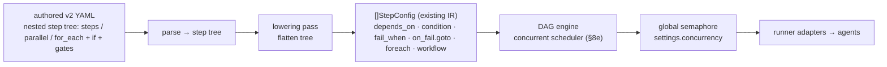
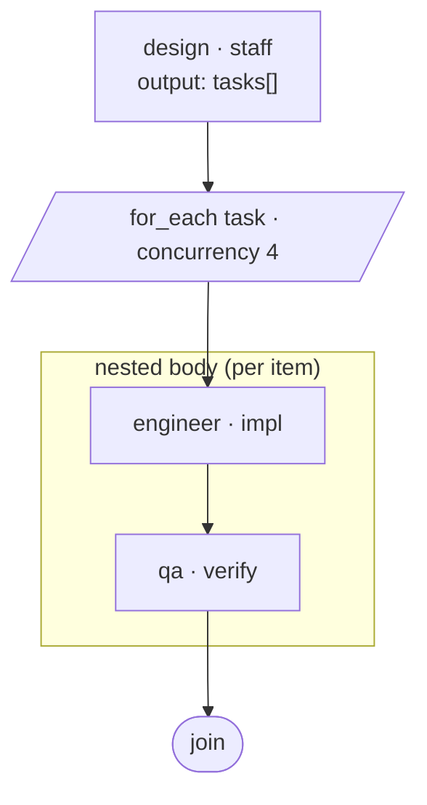
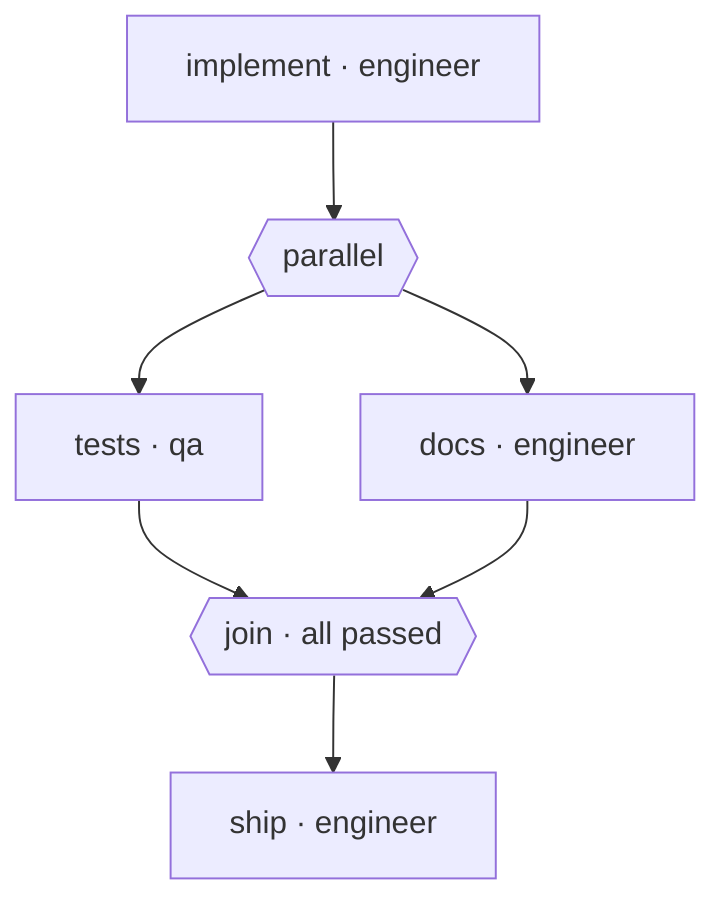
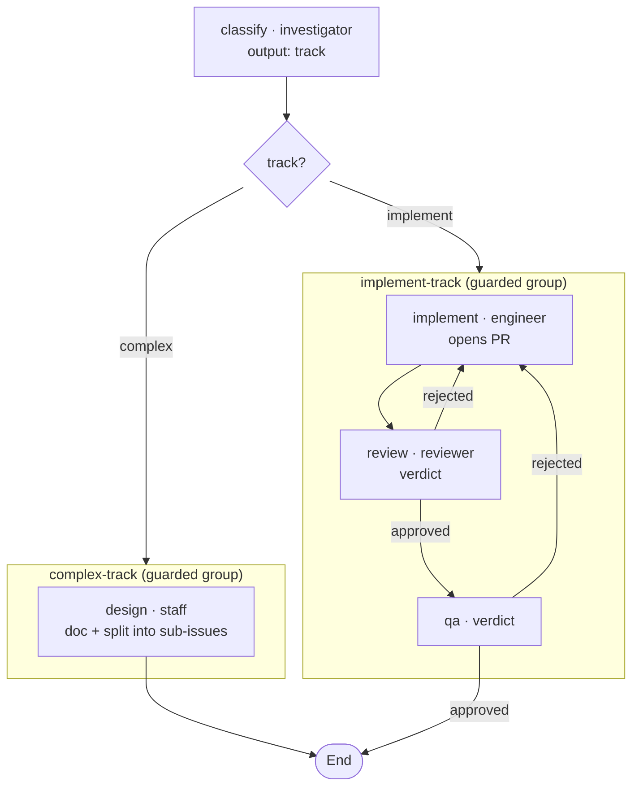
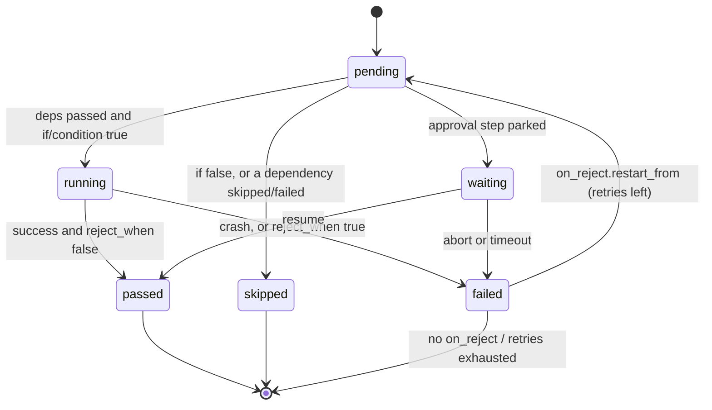
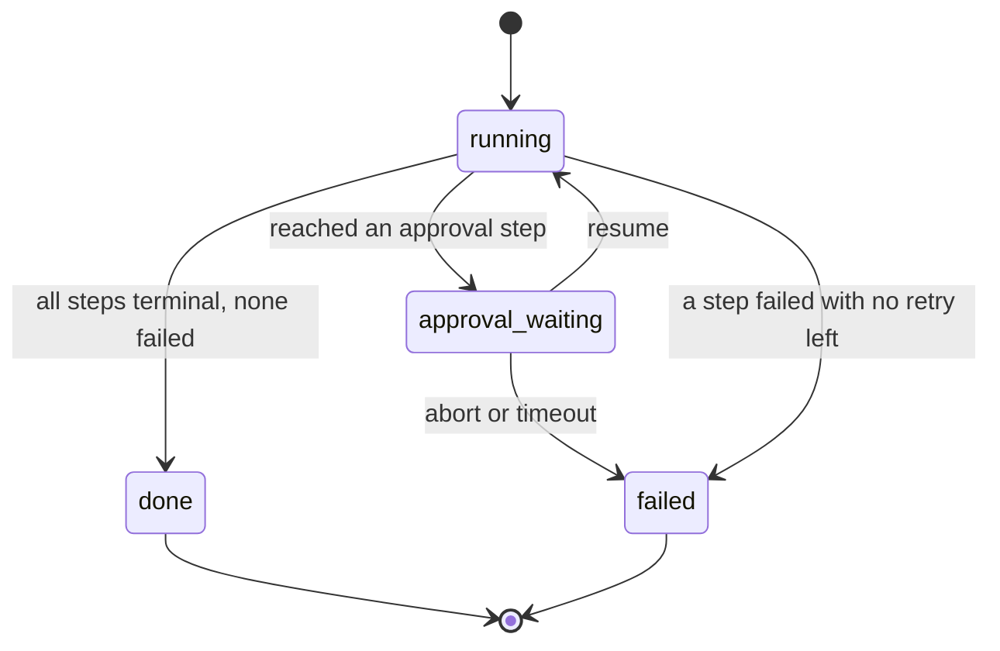
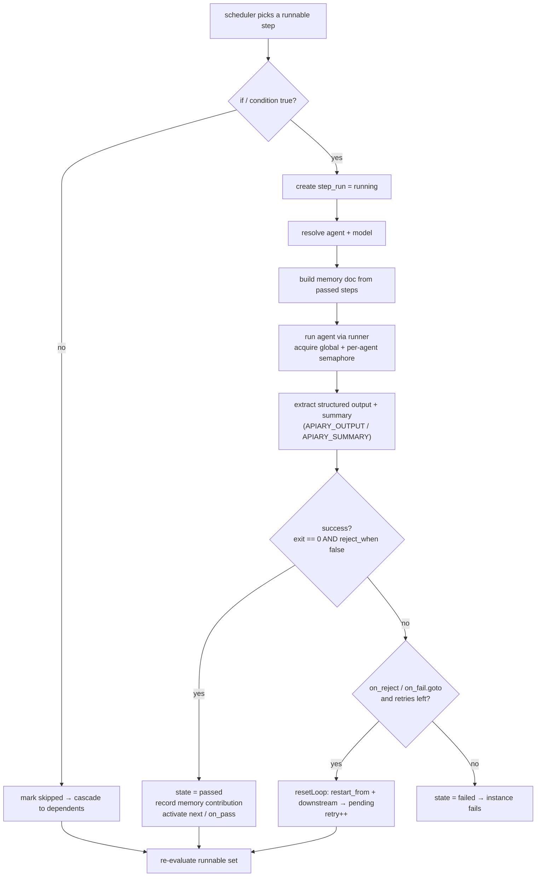

# Design — Workflow authoring v2 (GitHub Actions–inspired)

> Design only. Describes the authoring surface, how it lowers to the current DAG
> engine, and the small engine capabilities it needs.

## 0. Inspiration: GitHub Actions

The authored surface follows the GitHub Actions `steps:` model, which already
matches the requested feel: an ordered `steps:` list that runs top-to-bottom, each
step optionally guarded by `if:`, with outputs referenced across steps. We borrow
that feel but **diverge on composition**: Actions is flat, whereas here sub-steps,
parallel, and loops are **nested inside a parent step** (§1) — more readable, no
references.

| GitHub Actions            | Apiary v2                              |
|---------------------------|---------------------------------------|
| `steps:` (ordered, flat)  | `steps:` (ordered, **nestable** tree) |
| `uses:` / `run:`          | `agent:` (leaf); composition is nesting, not `uses:` |
| `with:`                   | `prompt:` (per-step instruction)      |
| `id:`, `name:`            | `id:`, `name:`                        |
| `if: ${{ … }}`            | `if: ${{ … }}` on a step **or a whole group** |
| step outputs (`$GITHUB_OUTPUT`) | `output:` schema, filled from `APIARY_OUTPUT` |
| `${{ steps.x.outputs.y }}`| `${{ steps.x.outputs.y }}` (short: `x.y`) |
| `github`, `env` contexts  | `cell`, `workflow` contexts           |
| `strategy.matrix`         | nested `for_each:` + `as:` + `steps:` |
| parallel jobs             | explicit `parallel:` step with a `join` outcome |
| `continue-on-error`       | `reject_when` + `on_reject` (richer: loop-back) |

Where Actions stops (no "reject → redo an earlier step", flat steps only), we add
nested composition (§1, §8) and the gate primitives (§2).

## 1. Authoring model — a nested step tree

`steps:` is an **ordered tree**. Composition is **visual nesting**, never
references or `depends_on`: if a step has sub-steps, runs things in parallel, or
loops, those steps live **inside** it. The indentation *is* the control flow — you
read the whole pipeline top-to-bottom without chasing ids.

A step is one of four kinds:

**Leaf — an agent step**
```yaml
- id: review                 # optional; required only if referenced by an expr
  name: Review the PR        # optional, human label
  agent: reviewer
  prompt: "..."              # optional per-step instruction
  if: ${{ classify.track == 'implement' }}   # optional guard
  output: { verdict: { enum: [approved, rejected] } }   # structured output
  reject_when: ${{ review.verdict == 'rejected' }}
  on_reject: { restart_from: implement, max: 3 }
```

**Group — sequential sub-steps** (this is "sub-workflow", inline)
```yaml
- id: implement-track
  if: ${{ classify.track == 'implement' }}   # guard the whole group
  steps:                                      # run in order, nested
    - { id: implement, agent: engineer }
    - { id: review,    agent: reviewer, reject_when: ..., on_reject: { restart_from: implement } }
    - { id: qa,        agent: qa }
```

**Parallel — concurrent sub-steps**
```yaml
- id: checks
  parallel:                                   # run nested steps at once; join after
    - { id: tests, agent: qa }
    - { id: docs,  agent: engineer }
```

**Loop — sub-steps per child item**
```yaml
- id: build-tasks
  for_each: ${{ design.tasks }}               # array from a prior step's output
  as: task
  concurrency: 4                              # optional; items at once
  steps:                                      # nested body runs per item
    - { id: impl,   agent: engineer, prompt: "Implement: ${{ task.title }}" }
    - { id: verify, agent: qa }
```

Rules:
- **Implicit sequencing.** Within any `steps:` list, step *N* runs after step *N-1*.
  Declaration order = execution order. No `depends_on` in the authored form.
- **Nesting = composition.** A group/parallel/loop step *contains* its children;
  there is no `uses:`/reference and no cross-step `depends_on`. Reuse, if needed,
  is by copying a group or (future) a top-level template — not by reference, to keep
  the YAML self-contained and readable.
- **`if:` guards any step**, including a whole group — so branching is "a guarded
  group" (the complex track vs the implement track), not a condition repeated on
  every line. A skipped group skips all its children.
- **Outputs & references.** Declaring `output:` makes a step's fields addressable as
  `${{ steps.<id>.outputs.<field> }}` (short `<id>.<field>`). No manual `memory.write`.
- **Expressions** use `${{ … }}` over contexts `steps`, `cell`, `workflow`.
- **Gates** (`reject_when`/`on_reject`) work on any leaf step; `restart_from`
  targets an earlier sibling in the same `steps:` list (§2).

## 2. Approval / reject gates (beyond Actions)

```yaml
- id: review
  agent: reviewer
  output: { verdict: { enum: [approved, rejected] } }
  reject_when: ${{ steps.review.outputs.verdict == 'rejected' }}
  on_reject: { restart_from: implement, max: 3 }
```

- After the agent runs, evaluate `reject_when` against the step's **own** fresh
  output → true means **rejected** (a logical failure, distinct from a crash).
- `on_reject.restart_from: <earlier step id>` re-runs from that step (and
  everything after), up to `max` times.
- No `on_reject` + rejected, or retries exhausted → the workflow fails →
  `on_fail` (e.g. `add_labels: [needs-attention]`) — escalate to a human.
- A real crash (agent exits non-zero) is still a failure independent of
  `reject_when`.

## 3. Engine capabilities needed

Everything else is authoring-time lowering. The engine needs three additions; the
first two are small and localized, the third (concurrency) is the substantial one
and is now **in scope** (§8e).

1. **`fail_when`** on the agent step. Today `Success = (cli exit == 0)`
   (`runner/execution/cli.go:197`). In `workflow/dag.go` `runAgentDAGStep`, after
   `runStep` returns `res`, build a transient eval context = current memory +
   *this* step's fresh structured output, then
   `failed := !res.Success || eval(fail_when)`. Reuse `EvalContext` /
   `ParseExpr` / `Eval` (`workflow/expr.go`). Existing `on_fail.goto` +
   `max_retries` + `resetLoop` handle the loop-back unchanged.

2. **Step-level `condition`** (the lowered form of per-step `if:`). In
   `pickRunnable`/scheduling, a step whose `condition` evaluates false is marked
   **skipped** (cascading to dependents via existing `markSkipped`). This is the
   GHA `if:` semantics and is simpler than synthesizing a `split` per condition.

3. **Concurrent scheduler + global agent semaphore** (§8e) — runs all
   currently-runnable steps at once and bounds total simultaneous agent invocations
   by `settings.concurrency`. This is what makes `parallel:` and
   `for_each.concurrency` real.

## 4. Lowering v2 → current DAG `StepConfig`



The parser builds a **step tree** and a lowering pass flattens it to today's
`[]StepConfig`. The author never sees `depends_on`/`goto`/`split`; nesting and order
carry all the structure.

| v2 (authored, nested)         | Lowered form |
|-------------------------------|--------------|
| order within a `steps:` list  | `depends_on: [<previous sibling id>]` |
| **group** (`steps:` nested)   | inline as a sub-chain: first child `depends_on` the group's predecessor, the group's successor `depends_on` the last child (or → an anonymous `type: workflow` sub-run when isolation is wanted) |
| **parallel** (`parallel:` + `join`) | children all `depends_on` the predecessor and run concurrently (§8e); the parallel step's outcome = the `join` policy (`all`/`any`/`${{ expr }}`) evaluated over child results; successor `depends_on` the parallel step |
| **loop** (`for_each:` + `steps:`) | `type: foreach` whose per-item body is the nested steps (anonymous sub-workflow when the body has >1 step; today's `foreach.step` is single → extend to a step list or wrap) |
| `if: ${{ … }}` on any step    | step-level `condition` (§3.2); on a group/parallel/loop it guards the whole subtree (children skip-cascade) |
| `${{ steps.x.outputs.y }}` / `x.y` | flat `memory.y` lookup; parser adds `y` to step *x*'s `memory.write` (field names unique per workflow; else qualify) |
| `output: {…}`                 | `output_schema: {…}` (alias) |
| `reject_when` / `on_reject`   | `fail_when` (§3.1) / `on_fail: {goto: restart_from, max_retries: max}` |

`split`/`goto`/`depends_on` are **not** authored — branching is a guarded group,
sequence is nesting order. They remain valid hand-written low-level primitives
(§6). Because lowering targets existing structures, current engine tests keep
passing and v2 is verified by asserting the lowered DAG matches a golden
`[]StepConfig`.

**Engine note:** the one place the existing IR is thin is multi-step `foreach`
bodies — `config.StepConfig.Step` is a single `*StepConfig`. The loop lowering
either (a) wraps a multi-step body in an anonymous sub-workflow (reuses
`type: workflow`), or (b) `foreach.step` is widened to a step list. Decide at
implementation; (a) reuses more existing machinery.

## 5. Reject feedback survives the loop (via the PR, not memory)

`resetLoop(target)` resets the target and its transitive dependents to pending and
**deletes their memory contributions**. So when `review` rejects and restarts from
`implement`, the reviewer's contribution is wiped — the engineer would not see the
feedback through workflow memory.

Resolution: rejection feedback lives on the **PR** (reviewer posts a real GitHub
review/comments; QA posts findings). On restart, the engineer re-reads the PR
thread. Workflow memory only carries the gate verdict. This matches how human teams
work and sidesteps the memory reset. Souls are written accordingly.

## 6. Backward compatibility

- `depends_on`, `split`/`branches`/`goto` remain valid — the low-level IR the v2
  surface lowers to. Existing configs run unchanged.
- The authored surface is **nesting + order + `if:`**; `depends_on`/`split`/`goto`
  are not authored (only emitted by lowering, or hand-written as an advanced escape
  hatch).
- v2 is additive. A flow may not mix authored nesting with hand-written `goto`
  (validation rejects the ambiguous mix).
- Docs/examples move to v2; `split`/`depends_on` documented as low-level.

## 7. Decisions (review round 1) & remaining questions

Resolved:
1. **Composition = visual nesting** (round 2). A step that has sub-steps, parallels,
   or loops *contains* them; no `uses:`/reference, no authored `depends_on`. Nesting
   and order carry all structure.
2. **Branching = a guarded nested group** — `if:` on a group runs/skips the whole
   subtree (the complex track vs the implement track). `if:` on a single step still
   works for one-off guards. (Supersedes the round-1 "per-step `if:` only" idea.)
3. **Parallelism is explicit** — only steps nested under a `parallel:` step run
   concurrently, and that step owns its **join outcome** (`all` default / `any` /
   `${{ expr }}`); its success = the join, feeding the next step and `on_reject`.
4. **`depends_on`/`split`/`goto` are not authored** — they remain only as the
   lowered IR and as advanced hand-written escape hatches.
5. **Step-scoped references** `${{ steps.<id>.outputs.<field> }}` (short `<id>.<field>`).
6. **`output:`** adopted as the authored key (alias of `output_schema:`).

Remaining (decide at implementation):
- Whether to support the `${{ … }}` delimiter literally or accept bare expressions
  (e.g. `if: "classify.track == 'complex'"`). Leaning: accept both; `${{ }}` for
  GHA familiarity, bare for brevity.
- Field-name collisions when two steps emit the same output field — qualify by step
  id in the lowered `memory` namespace if it ever happens.

## 8. Composition: nested sub-steps, loops, parallel

Composition is **visual nesting** — a composite step contains its children; no
`uses:`/reference, no `depends_on`. All three lower onto existing engine structures.

### a) Sub-steps — a nested `steps:` group (inline "sub-workflow")
**Engine: built** (`StepTypeWorkflow`/sub-chain). A group step holds an ordered
`steps:` list that runs as a unit. This replaces the reference-based `uses:` — the
sub-pipeline lives where it's used.

```yaml
- id: implement-track
  if: ${{ classify.track == 'implement' }}    # guard the whole group
  steps:
    - { id: implement, agent: engineer }
    - { id: review,    agent: reviewer, reject_when: ..., on_reject: { restart_from: implement } }
    - { id: qa,        agent: qa }
```
Lowers to the children chained by `depends_on` (or an anonymous `type: workflow`
sub-run for isolation). A guarded group skips all its children when `if:` is false.

### b) Loop over child items — nested `for_each` (GHA `strategy.matrix`)
**Engine: built, but serial.** `StepTypeForeach` exists (`workflow/foreach.go`); it
iterates `items` bound to `as`, but the loop is a plain `for range` — `concurrency`
is parsed and **ignored** today. The loop body is a **nested `steps:` list**, not a
single step.

```yaml
- id: build-tasks
  for_each: ${{ design.tasks }}   # array from a prior step's output
  as: task
  max: 20            # cap (lowers to foreach max_items)
  concurrency: 4     # run N items at once  ← needs engine to honor it (§8e)
  steps:             # nested body runs per item
    - { id: impl,   agent: engineer, prompt: "Implement: ${{ task.title }}" }
    - { id: verify, agent: qa }
```
Use case: Staff emits a `tasks` array → fan out the nested body per task. Multi-step
body lowers via an anonymous sub-workflow (§4 engine note); `concurrency` needs §8e.



### c) Parallel steps — an explicit `parallel:` step with a join outcome
**Engine: in scope** (scheduler design in §8e). Parallelism is never implicit: you
**declare** a step whose children run concurrently, and that step decides its own
**outcome** from the children's results. Nothing runs in parallel unless you nest it
under a `parallel:` step.

```yaml
- id: checks
  parallel:                         # children run concurrently
    - { id: tests, agent: qa,       output: { ok: { type: boolean } } }
    - { id: docs,  agent: engineer, output: { ok: { type: boolean } } }
  join: all                         # outcome policy (default: all)
  # join options:
  #   all                  → step passes iff every child passed   (default)
  #   any                  → passes iff at least one child passed
  #   ${{ expr }}          → custom: passes iff the expr is true
  #                          e.g. join: ${{ tests.ok && docs.ok }}
  on_reject: { restart_from: implement, max: 3 }   # react to a failed join
```

The `parallel:` step is itself a normal step: its **success/fail is the `join`
result**, so the next step runs only when the join passed, and `reject_when`/
`on_reject` work on it like any gate. Lowering: children all `depends_on` the
parallel step's predecessor and run concurrently (§8e); the parallel step's outcome
is computed from the children per `join`; the successor `depends_on` the parallel
step. So the join is **explicit and owned by the step**, not an implicit
"next step depends on all".



### d) Concurrency model
Adopt the original `concurrency-model` decision: `settings.concurrency` is one
global cap on simultaneous agent invocations across all instances, parallel steps,
and foreach items. Every runner call acquires/releases one slot. This is what makes
`for_each.concurrency` and `parallel:` safe (no 24-agents-on-one-workdir blowups).
Per-agent `max_workers` remains as a secondary cap (acquire both).

### e) Concurrent scheduler design (the substantial piece)

Turn the sequential loop into a concurrent one:

- **`pickAllRunnable()`** replaces `pickRunnable()` — returns *every* step that is
  activated, pending, condition-true, and deps-passed.
- The driver launches each on a goroutine that acquires a **global semaphore**
  (`settings.concurrency`) and its per-agent slot before invoking the runner, and
  releases on completion. Results return on a channel.
- A single **scheduler goroutine owns `dagRun` state**; worker goroutines only run
  agents and send results back. The scheduler applies each result (set
  passed/failed, split activation, `on_fail.goto` reset), then re-computes the
  runnable set and dispatches newly-unblocked steps. No shared-state mutation off
  the scheduler goroutine → no lock sprawl. (`dagRun` stays single-writer.)
- **Termination:** done when nothing is running and nothing is runnable; then the
  existing failed/skip logic decides the outcome.

Concurrency-specific decisions:
- **Deterministic memory ordering.** `passedOrder` must order by **declaration
  order**, not completion order, so the memory document and last-write-wins are
  reproducible regardless of who finishes first.
- **Loop-back while siblings run.** If a step triggers `on_fail.goto`, the
  scheduler stops dispatching new work, lets in-flight siblings finish (or cancels
  them — decision below), applies `resetLoop`, then resumes. Default: **let
  in-flight finish, then reset** (simpler, no cancellation races).
- **Approval steps** force a quiesce: when an approval becomes runnable the
  scheduler drains in-flight steps, then parks (`outcomeWaiting`) as today.
- **`for_each.concurrency`** uses the same global semaphore for its item runs.

Risk/cost: this is the largest part. It is additive — when `settings.concurrency`
is 1, behaviour is identical to today's sequential executor, so existing tests and
flows are unchanged; concurrency is opt-in by raising the cap and using `parallel:`.

**Scope summary:** (b) ~free (alias); (a) easy (alias, real once §8e lands);
(c)+(d)+(e) are the real engineering, now included in this change.

## 9. Worked example — the two target flows (authored form)



The authored YAML — two **guarded nested groups**, one per track (the `if:` guards
the whole group; gates loop back to a sibling inside the group):

```yaml
workflows:
  - id: triage
    trigger:
      match: { source: project-erp, exclude_label_prefix: "agent:" }
    steps:
      - id: classify
        name: Classify the issue
        agent: investigator
        output: { track: { enum: [implement, complex] } }

      # Complex track → Staff documents + splits into sub-issues, then End.
      - id: complex-track
        if: ${{ classify.track == 'complex' }}
        steps:
          - { id: design, name: Design & decompose, agent: staff }

      # Implementation track → Engineer → Reviewer → QA, reject loops back.
      - id: implement-track
        if: ${{ classify.track == 'implement' }}
        steps:
          - { id: implement, name: Implement & open PR, agent: engineer }

          - id: review
            name: Review the PR
            agent: reviewer
            output: { verdict: { enum: [approved, rejected] } }
            reject_when: ${{ review.verdict == 'rejected' }}
            on_reject: { restart_from: implement, max: 3 }

          - id: qa
            name: QA validation
            agent: qa
            output: { verdict: { enum: [approved, rejected] } }
            reject_when: ${{ qa.verdict == 'rejected' }}
            on_reject: { restart_from: implement, max: 3 }

    on_complete: { set_state: closed }
    on_fail:     { add_labels: [needs-attention] }
```

Notice the condition appears **once per track** (on the group), not on every step.

## 10. Engine state machines & execution flow

These reflect the actual engine (`workflow/dag.go` step states, `engine.go`
`settle`, `db.InstanceState*` / `db.StepState*`) plus the v2 additions
(`condition`, `reject_when`/`on_reject`).

### Step lifecycle (state machine)



`failed --> pending` is the loop-back: `resetLoop` resets the `restart_from` target
**and everything downstream of it** back to `pending` (clearing their memory
contributions) so the branch re-runs; the per-step retry counter bounds it by `max`.

### Workflow instance lifecycle (state machine)



`done`/`failed` fire `on_complete`/`on_fail` (result comment, `set_state`,
`add_labels`); `approval_waiting` parks the instance until the poll loop resolves it.

### Step execution flow (what one step does)



For a **parallel** step the same flow runs per child concurrently; the parent's
pass/fail is then the `join` policy (`all`/`any`/`${{ expr }}`) over the children.
For a **foreach** step it runs per item (bounded by the global semaphore).
